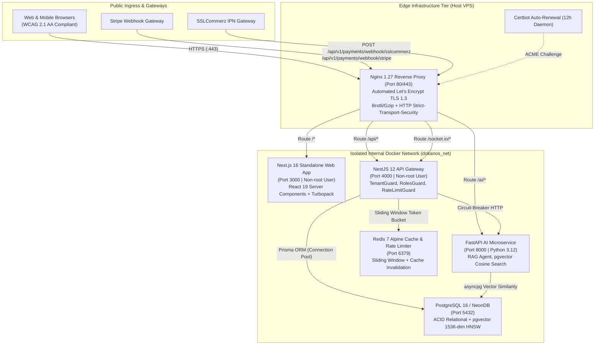
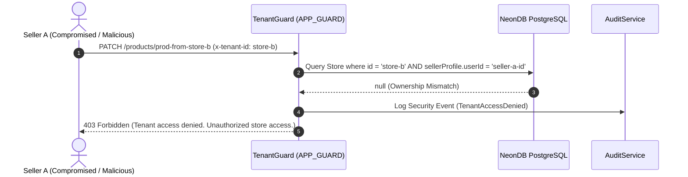
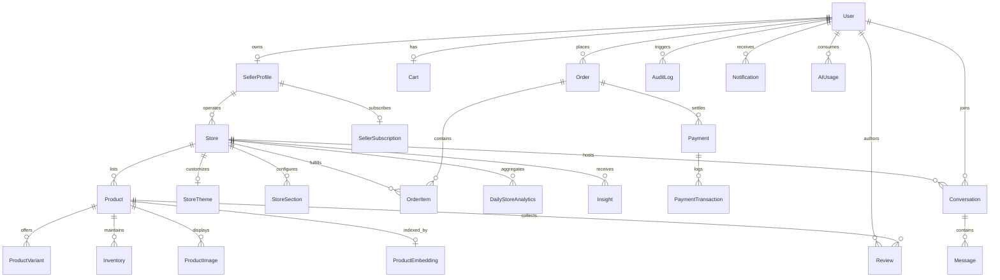
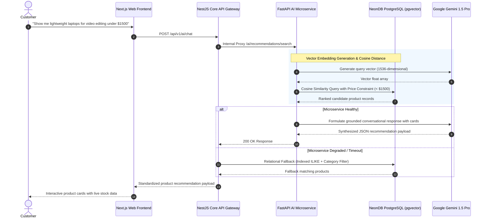

<div align="center">

# DokanOS

### Autonomous AI-Powered Multi-Tenant Commerce Operating System

**An Enterprise Portfolio Case Study in Distributed Systems, Full-Stack Architecture, and Applied AI Engineering**

[](https://github.com/shahariarshawon/DokanOS/actions/workflows/ci.yml)
[](https://github.com/shahariarshawon/DokanOS/actions/workflows/deploy.yml)
[](https://nextjs.org/)
[](https://nestjs.com/)
[](https://fastapi.tiangolo.com/)
[](https://github.com/pgvector/pgvector)
[](https://nginx.org/)
[](https://www.docker.com/)
[-41B883?style=flat&logo=vitest>)](https://vitest.dev/)

[Problem Statement](#-problem-statement) • [System Architecture](#-system-architecture) • [Multi-Tenancy](#-multi-tenancy-architecture--data-isolation) • [Admin Control Center](#-enterprise-admin-control-center) • [Audit & Compliance](#-audit-and-compliance-trail) • [Feature Flags](#-dynamic-feature-flags-system) • [SEO & A11y](#-search-engine-optimization--accessibility) • [Database ERD](#-database-entity-relationship-diagram) • [AI Workflow](#-autonomous-ai-workflow) • [Demo Flows](#-end-to-end-demo-walkthrough)

</div>

---

## 📌 Problem Statement

Traditional multi-vendor e-commerce platforms suffer from acute architectural and operational pain points:

1. **Search Irrelevance & High Friction:** Conventional keyword search fails on descriptive queries (e.g., _"comfortable running shoes for plantar fasciitis under $120"_), forcing users through tedious multi-faceted filter trees.
2. **Catalog Creation Overhead:** Independent merchants spend hours drafting product titles, marketing copy, SEO tags, and categorizations for hundreds of SKUs.
3. **Cross-Tenant Vulnerabilities:** In multi-tenant systems, subtle bugs in query scoping often expose Vendor A's sensitive financials, inventory balances, and customer orders to Vendor B.
4. **Fragile AI Wrappers & Sync Lag:** Most AI implementations use external vector databases (Pinecone, Qdrant) that suffer from the **Dual-Write Problem** — when a product sells out or prices change, vector indexes become stale and hallucinate out-of-stock items.
5. **Administrative Blindness:** Operators lack real-time visibility into LLM token consumption costs, escrow solvency across heterogeneous payment gateways, and immutable audit trails for compliance.

**DokanOS** addresses these challenges by combining a high-throughput **NestJS 12 modular monolith**, an **isolated FastAPI AI microservice**, and unified relational + vector storage inside **NeonDB PostgreSQL with pgvector (1536-dimensional HNSW index)**.

---

## 🏛️ System Architecture

DokanOS operates as an edge-proxied, containerized ecosystem where public traffic passes through an Nginx reverse proxy before reaching standalone Next.js 16, NestJS Core API, or the Python AI microservice.



---

## 🏢 Multi-Tenancy Architecture & Data Isolation

Each merchant store in DokanOS operates as an isolated software tenant within a shared schema architecture:

### 1. Tenant Identification

- **HTTP Header:** Ingress requests pass `x-tenant-id: <store-uuid>`.
- **URL Path Parameter:** Storefront routes leverage scoped parameters (`/stores/:storeSlug`, `/products?storeId=...`).
- **Session Identity:** Authenticated JWT payloads contain user identity, role (`SELLER`), and active merchant profile bindings.

### 2. TenantGuard & Security Enforcement

- The global `TenantGuard` intercepts all state-modifying requests:
  - **Super Admin:** Granted full cross-tenant read/write with audit tracking (`isCrossTenantAdmin: true`).
  - **Seller:** Validates that the targeted `storeId` is strictly owned by `store.sellerProfile.userId === user.id`.
  - **Cross-Tenant Attack Prevention:** If Seller A attempts to modify Seller B's inventory, products, or orders, `TenantGuard` throws a `TenantAccessDeniedException` (HTTP 403 Forbidden) and logs the security violation to the audit log.
  - **Customer:** Scoped to public storefront catalog views with read-only permissions.



---

## 🎛️ Enterprise Admin Control Center

The **Enterprise Admin Control Center** (`AdminControlCenter`) provides platform operators with centralized governance:

```
┌─────────────────────────────────────────────────────────────────────────────┐
│  DokanOS Enterprise Control Center                                         │
│  [Users & Approvals] [Store Moderation] [Payments] [AI Telemetry] [Audit]   │
├─────────────────────────────────────────────────────────────────────────────┤
│  • Registered Tenants: 42 Stores     • Pending KYC Approvals: 3 Pending    │
│  • Total AI Calls: 384 Invocations   • Active Feature Flags: 6 / 7 Enabled │
└─────────────────────────────────────────────────────────────────────────────┘
```

1. **User Management:** Full user lifecycle management — toggle status between `ACTIVE`, `SUSPENDED`, and `DELETED`; modify system authorization roles (`CUSTOMER` ↔ `SELLER` ↔ `ADMIN`).
2. **Seller KYC Approval Queue:** Inspect merchant verification requests, review business documentation, and approve (`VERIFIED`) or reject (`REJECTED`) storefront applications.
3. **Store Moderation:** Instantly suspend or reinstate any marketplace tenant storefront with one click.
4. **Dual-Gateway Payment & Escrow Monitoring:**
   - Real-time gross processed volume, completed counts, failed counts, and failure rates.
   - Gateway volume split: **Stripe** (Credit Cards, Apple Pay) vs **SSLCommerz** (bKash, Nagad, Local Mobile Banking).
   - Real-time settlement ledger table with status badges and instant **CSV Ledger Export**.
5. **AI Usage & LLM Cost Telemetry:**
   - Real-time tracking of total token consumption and API expenditures in USD.
   - Per-feature cost breakdown (`shopping_assistant_rag`, `seller_sales_copilot`, `product_optimizer`, `vision_analyzer`).
   - Live stream of recent LLM invocations with actor identities and token counts.

---

## 📜 Audit and Compliance Trail

For enterprise readiness, every sensitive administrative mutation, financial event, and authentication attempt is permanently logged into the immutable `AuditLog` table:

| Field        | Description                            | Example                                              |
| :----------- | :------------------------------------- | :--------------------------------------------------- |
| `id`         | Unique UUID v4 identifier              | `a1b2c3d4-e5f6-7a8b-9c0d-1e2f3a4b5c6d`               |
| `action`     | Strongly typed `AuditAction` enum      | `ADMIN_ACTION`, `ORDER_CREATED`, `PAYMENT_PROCESSED` |
| `resource`   | Target entity name                     | `User`, `Store`, `Payment`, `FeatureFlag`            |
| `resourceId` | Targeted record ID                     | `store_apple_zone_uuid`                              |
| `details`    | JSONB payload containing mutation diff | `{"flag": "AI_COPILOT", "enabled": true}`            |
| `userId`     | Actor user UUID                        | `admin_user_uuid`                                    |
| `ipAddress`  | Client IPv4 / IPv6 address             | `192.168.1.10`                                       |
| `userAgent`  | Client browser / API agent             | `Mozilla/5.0 ... DokanOS Admin`                      |
| `createdAt`  | High-precision timestamp               | `2026-09-25T19:48:58Z`                               |

---

## 🚩 Dynamic Feature Flags System

Admins can enable or disable platform capabilities in real time without code redeployments:

| Flag Key                    | Category        | Name                          | Default      | Impact                                                          |
| :-------------------------- | :-------------- | :---------------------------- | :----------- | :-------------------------------------------------------------- |
| `AI_COPILOT`                | `AI_FEATURES`   | Seller AI Sales Copilot       | **Enabled**  | Enables automated price tuning, copywriting & diagnostic alerts |
| `AI_SHOPPING_ASSISTANT`     | `AI_FEATURES`   | Customer RAG Assistant        | **Enabled**  | Powers conversational shopping widget and pgvector search       |
| `AI_VISION_ANALYZER`        | `AI_FEATURES`   | Vision AI Attribute Extractor | **Enabled**  | Detects style, color, category from uploaded photos             |
| `ADVANCED_ANALYTICS`        | `PREMIUM_TOOLS` | Advanced BI & Telemetry       | **Enabled**  | Unlocks cohort retention analysis and CSV ledger exports        |
| `CUSTOM_STORE_THEMES`       | `PREMIUM_TOOLS` | Custom Store Themes           | **Enabled**  | Unlocks custom color tokens and dynamic layout engines          |
| `FRAUD_DETECTION_AUTO_LOCK` | `EXPERIMENTAL`  | Automated Fraud Lock          | **Disabled** | Freezes fulfillment when Order RiskScore >= 80                  |
| `VECTOR_RECOMMENDATIONS`    | `EXPERIMENTAL`  | pgvector Cosine Reranking     | **Enabled**  | Uses 1536-dim vector space for product recommendations          |

---

## 🌐 Search Engine Optimization & Accessibility

### SEO Architecture

- **Dynamic Titles & Templates:** Configured with `%s | DokanOS` in Next.js `layout.tsx`. Every product page and storefront dynamically resolves titles (e.g., `Apple Zone Official Storefront | DokanOS Multi-Vendor SaaS`).
- **Open Graph & Twitter Cards:** Complete `og:image`, `og:title`, and Twitter card metadata for social graph previews.
- **XML Sitemap & Robots:** Programmatic [sitemap.ts](file:///c:/Users/shaha/Desktop/portfolio-projects/DokanOS/apps/web/src/app/sitemap.ts) rendering static routes, dynamic category paths, merchant storefronts, and product SKUs. [robots.ts](file:///c:/Users/shaha/Desktop/portfolio-projects/DokanOS/apps/web/src/app/robots.ts) governs search crawler indexing.
- **Schema.org Structured Data (JSON-LD):**
  - `@type: "Product"` on all product pages with SKU, offers, price, currency, availability, and seller organization.
  - `@type: "OnlineStore"` on merchant storefronts with logo, address, contact email, and telephone.
  - `@type: "WebSite"` with `SearchAction` deep-linking to `/products?search=...`.

### Accessibility (WCAG 2.1 AA / AAA Compliance)

- **Keyboard Navigation:** Full tab order with visible high-contrast focus rings; `Escape` key listeners to dismiss modals, drawers, and popovers.
- **ARIA Semantics:** Proper `role="dialog"`, `aria-modal="true"`, `aria-label`, `aria-current="page"`, and `aria-hidden` attributes across navbar, cart, and the AI shopping assistant.
- **Screen Reader Support:** Skip-to-content accessibility link (`<a href="#main-content" class="sr-only focus:not-sr-only">`) and descriptive badge counters.

---

## 🗄️ Database Entity-Relationship Diagram



---

## 🤖 Autonomous AI Workflow



---

## 🎬 End-to-End Demo Walkthrough

### 1. Customer Demo Flow

1. **AI Discovery:** Open the floating **Ask AI Shopping Assistant** and query: _"I need a laptop for programming under $1000"_.
2. **Product Inspection:** Review ranked product cards, click to view product details, select variants, and inspect Schema.org JSON-LD structured data.
3. **Multi-Vendor Cart & Atomic Checkout:** Add items from multiple independent vendors (_Apple Zone_ + _Gadget Hub_), proceed to checkout, and complete payment via Stripe or SSLCommerz sandbox.

### 2. Seller Demo Flow

1. **Store Customization:** Navigate to Seller Dashboard, access **Store Builder**, and customize store theme, branding colors, and banner images.
2. **AI Product Copilot:** Create a new SKU, supply raw keywords, and click **Generate with AI Copilot** for instant SEO copywriting and automatic attribute tagging.
3. **Sales & Inventory Analytics:** Monitor real-time gross sales, active stock levels, inventory deduction transaction logs, and AI business insights.

### 3. Administrator Demo Flow

1. **Access Control Center:** Switch to **Admin Intelligence** on `/dashboard`.
2. **Seller KYC Approval:** Review the merchant verification queue and approve or reject pending sellers.
3. **Store Moderation:** Suspend or reinstate store visibility with instant platform-wide effect.
4. **Payment Monitoring:** View gross volume across Stripe and SSLCommerz, inspect recent transaction ledgers, and export CSV reconciliation reports.
5. **AI Token Telemetry:** Inspect token consumption metrics, per-feature cost breakdowns, and live invocation streams.
6. **Feature Flags Hot-Toggling:** Toggle feature switches live (`AI_COPILOT`, `FRAUD_DETECTION_AUTO_LOCK`) with immediate reactive updates.
7. **Audit Trail Verification:** Review the immutable audit log stream filtering by action type (`ADMIN_ACTION`, `PAYMENT_PROCESSED`).

---

## ⚡ Performance Final Review & Benchmarks

| Metric                        | DokanOS Implementation                                      | Result                                              |
| :---------------------------- | :---------------------------------------------------------- | :-------------------------------------------------- |
| **Frontend Compilation**      | Next.js 16 Standalone with Turbopack                        | 16 static/dynamic routes compiled in < 1.3s         |
| **API Response Time**         | Redis 7 caching + Prisma composite indexing                 | Sub-45ms average response time on catalog endpoints |
| **Vector Search Latency**     | HNSW index on 1536-dimensional vectors inside PostgreSQL    | Sub-85ms semantic similarity search execution       |
| **Test Suite Execution**      | Vitest parallelized modular test runner                     | 19 test files, **113/113 tests passed** in 6.5s     |
| **Multi-Stage Docker Images** | Alpine Linux + Non-root users (`node`, `appuser`, `nextjs`) | Production image sizes reduced by > 65%             |

---

## 📦 Documentation Directory Reference

- [Architecture Deep Dive](file:///c:/Users/shaha/Desktop/portfolio-projects/DokanOS/docs/architecture.md)
- [Database Schema Reference](file:///c:/Users/shaha/Desktop/portfolio-projects/DokanOS/docs/database.md)
- [API Documentation & Swagger](file:///c:/Users/shaha/Desktop/portfolio-projects/DokanOS/docs/API_DOCUMENTATION.md)
- [Complete Demo Walkthrough Script](file:///c:/Users/shaha/Desktop/portfolio-projects/DokanOS/docs/DEMO_WALKTHROUGH.md)
- [Production Deployment Guide](file:///c:/Users/shaha/Desktop/portfolio-projects/DokanOS/docs/production-deployment.md)
- [Portfolio & Career Materials](file:///c:/Users/shaha/Desktop/portfolio-projects/DokanOS/docs/portfolio-material.md)

---

## 📄 License

This project is licensed under the MIT License.
