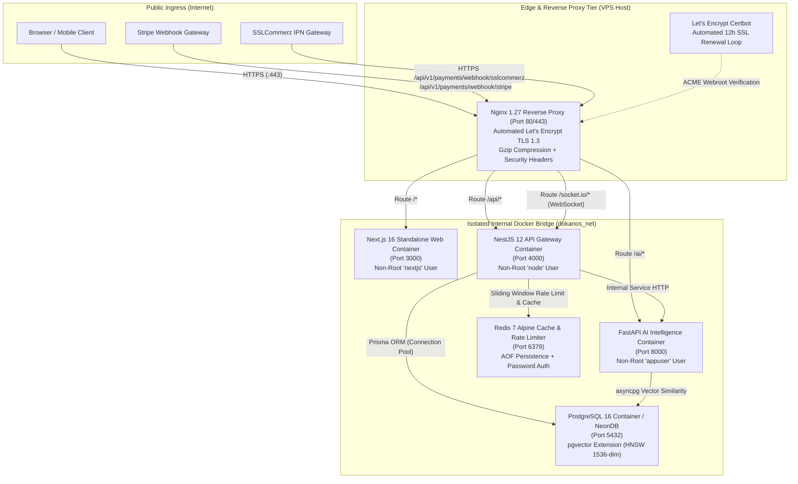
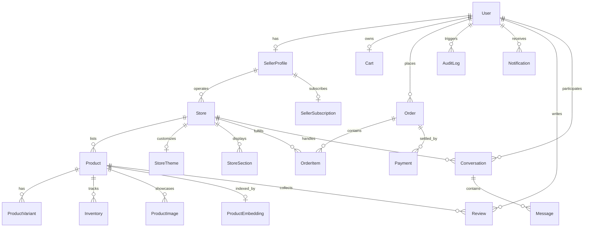

<div align="center">

# DokanOS

### Autonomous AI-Powered Multi-Tenant Commerce Operating System

An enterprise-grade, polyglot commerce platform combining high-throughput marketplace operations with an autonomous AI microservice (RAG Shopping Assistant, pgvector semantic search, and Seller Copilot).

[](https://github.com/shahariarshawon/DokanOS/actions/workflows/ci.yml)
[](https://github.com/shahariarshawon/DokanOS/actions/workflows/deploy.yml)
[](https://nextjs.org/)
[](https://nestjs.com/)
[](https://fastapi.tiangolo.com/)
[](https://github.com/pgvector/pgvector)
[](https://nginx.org/)
[](https://www.docker.com/)
[-41B883?style=flat&logo=vitest>)](https://vitest.dev/)

[Architecture](#system-architecture) • [Database ERD](#database-entity-relationship-diagram) • [AI Workflow](#autonomous-ai-workflow) • [Demo Flows](#end-to-end-demo-flows) • [Production Deployment](#production-container-deployment) • [API Docs](#api-documentation) • [Monitoring](#monitoring--health-checks)

</div>

---

## Executive Overview

**DokanOS** bridges traditional multi-vendor marketplace friction with autonomous artificial intelligence. Rather than treating AI as a superficial chatbot wrapper, DokanOS tightly integrates 1536-dimensional semantic vector embeddings directly within the core relational database (**NeonDB PostgreSQL + pgvector**), enabling:

- **Conversational RAG Shopping Assistant:** Real-time semantic product discovery with hybrid keyword search, price constraints, and guaranteed relational fallback during microservice degradation.
- **Autonomous Seller Copilot:** Automated generation of SEO metadata, product copywriting, and categorized product attributes.
- **Production-Hardened Security:** Stateless JWT access tokens, cryptographic refresh token rotation, global sliding-window rate limiting, Helmet HTTP security headers, and cross-tenant isolation.
- **Atomic Multi-Vendor Checkout:** Inventory decrement and commission distribution executed inside transactional boundaries (`Prisma.$transaction`) with automated stock replenishment on cancellations.
- **Real-Time Telemetry & BI Dashboard:** WebSocket event streaming (`Socket.IO` + Redis adapter) powering interactive analytics for both vendor earnings and platform-level GMV take-rate tracking.

---

## System Architecture

DokanOS operates as a **modular monolith core API** paired with an **isolated AI vector microservice** behind an edge **Nginx reverse proxy**:



---

## Database Entity-Relationship Diagram



---

## Autonomous AI Workflow

```mermaid
sequenceDiagram
    autonumber
    actor Customer as Customer
    participant Web as Next.js Web
    participant Nginx as Nginx Proxy
    participant API as NestJS Core API
    participant AI as FastAPI Microservice
    participant DB as PostgreSQL + pgvector
    participant LLM as Google Gemini 1.5 Pro

    Customer->>Web: "Find lightweight noise-cancelling headphones under $250"
    Web->>Nginx: POST /api/v1/ai/chat
    Nginx->>API: Proxy to NestJS Core API
    API->>AI: Internal HTTP /recommendations/search

    rect rgb(240, 248, 255)
        note over AI,DB: Vector Embedding Generation & Semantic Search
        AI->>LLM: Generate query embedding vector (1536-dim)
        LLM-->>AI: Vector float array
        AI->>DB: Cosine Distance Query with Price Filter (&lt; $250)
        DB-->>AI: Top ranked candidate product records
    end

    alt Microservice Available
        AI->>LLM: Formulate conversational response with product cards
        LLM-->>AI: Synthesized JSON recommendation payload
        AI-->>API: 200 OK Response
    else Microservice Degraded / Timeout
        API->>DB: Relational Fallback (Indexed ILIKE + Category Filter)
        DB-->>API: Relational product results
    end

    API-->>Nginx: Unified standard response payload
    Nginx-->>Web: JSON payload with product cards
    Web-->>Customer: Interactive product recommendation view
```

---

## End-to-End Demo Flows

### 1. Customer Shopping Flow

1. **Product Discovery**: Browse marketplace catalog or search by category, price, and tags.
2. **AI Shopping Assistant**: Open conversational RAG drawer, enter natural language queries (e.g., _"Suggest a durable mechanical keyboard for coding"_), and receive real-time ranked recommendations with live stock data.
3. **Cart & Atomic Checkout**: Add products from multiple independent stores to a unified shopping cart, specify shipping address, and complete payment via Stripe or SSLCommerz sandbox.
4. **Order Tracking & Reviews**: Track order timeline (`PENDING` → `PAID` → `PROCESSING` → `SHIPPED` → `DELIVERED`) and submit verified purchase reviews.

### 2. Seller Store Builder & Operations Flow

1. **Store Creation**: Register as a `SELLER`, choose custom store slug (e.g., `dokanos.com/store/tech-vault`), and configure business profile.
2. **Store Builder Customization**: Live customizer for store themes (modern/minimalist/bold palettes, typography) and customizable homepage sections (Hero Banner, Featured Collection, About Us, Contact).
3. **AI Product Copilot**: Create product SKUs; generate product title, rich markdown description, and SEO metadata with one click via AI Copilot.
4. **Inventory & Order Fulfillment**: Track multi-variant inventory balances, view real-time incoming store orders, and update carrier tracking numbers.

### 3. Administrator Governance Flow

1. **Platform Oversight**: View platform-wide Gross Merchandise Value (GMV), net commission take-rate, and active merchant counts.
2. **Merchant Verification**: Inspect pending seller verification documents and approve/reject stores.
3. **Audit Log Inspection**: Review comprehensive audit logs at `GET /api/v1/audit-logs` filtering by user, action (`LOGIN`, `PRODUCT_UPDATED`, `ORDER_STATUS_CHANGED`, `PAYMENT_PROCESSED`), and resource ID.

---

## Production Hardening & Security Standards

| Focus Area               | Hardening Mechanism                   | Details                                                                                                                       |
| ------------------------ | ------------------------------------- | ----------------------------------------------------------------------------------------------------------------------------- |
| **Authentication**       | JWT Access & Refresh Token Rotation   | Stateless 15m access token; salted bcrypt hashed refresh token rotated on every issuance; clears sessions on password change. |
| **Password Reset**       | Cryptographic One-Time Tokens         | Secure 256-bit random tokens with 1-hour expiration; generic response prevents email enumeration.                             |
| **Email Verification**   | Account Activation                    | Cryptographic activation token with 24-hour expiration window.                                                                |
| **Authorization (RBAC)** | Global Guard & Multi-Tenant Isolation | `CUSTOMER`, `SELLER`, and `ADMIN` role gates; Seller A cannot read/mutate Seller B stores, products, or orders.               |
| **Rate Limiting**        | Sliding Window (Redis + Fallback)     | `RateLimitGuard` tracks `user:<id>` or `ip:<addr>` with `X-RateLimit-*` and `Retry-After` response headers (HTTP 429).        |
| **Security Headers**     | Nginx + Helmet Middleware             | Enforces CSP, HSTS (`max-age=31536000`), `X-Frame-Options: DENY`, `X-Content-Type-Options: nosniff`.                          |
| **Error Shielding**      | Centralized Exception Filter          | Masks internal server errors (500) and database stack traces in production; attaches correlation IDs.                         |
| **Database Performance** | Prisma Composite Indexes              | Composite indexes on `Product`, `Order`, `Message`, and `AuditLog` for sub-10ms query execution.                              |
| **Caching Strategy**     | Redis Key Invalidation                | Popular products, storefront listings, and store builder pages cached with automated purging on catalog mutations.            |

---

## Production Container Deployment

DokanOS includes a complete multi-container production stack orchestrated via [docker-compose.prod.yml](file:///c:/Users/shaha/Desktop/portfolio-projects/DokanOS/docker-compose.prod.yml):

```bash
# 1. Clone repository on production host
git clone https://github.com/shahariarshawon/DokanOS.git /opt/dokanos
cd /opt/dokanos

# 2. Run automated VPS provisioning (installs Docker, UFW, Fail2ban)
bash scripts/setup-vps.sh

# 3. Configure production environment secrets
cp .env.production.example apps/api/.env
# Update DATABASE_URL, JWT secrets, Stripe keys, and DOMAIN_NAME

# 4. Build and start production service stack
docker compose -f docker-compose.prod.yml up -d --build

# 5. Issue Let's Encrypt SSL certificate
docker compose -f docker-compose.prod.yml run --rm certbot certonly \
  --webroot --webroot-path=/var/www/certbot \
  -d yourdomain.com -d www.yourdomain.com

# 6. Reload Nginx with SSL certificates
docker compose -f docker-compose.prod.yml exec nginx nginx -s reload
```

---

## CI/CD Pipeline

Every commit to `main` executes the automated continuous integration and delivery pipeline:

1. **Continuous Integration ([.github/workflows/ci.yml](file:///c:/Users/shaha/Desktop/portfolio-projects/DokanOS/.github/workflows/ci.yml))**:
   - Monorepo dependency caching (`pnpm`).
   - Code formatting validation (`prettier`).
   - Linting check (`eslint` & `oxlint`).
   - Prisma Client generation.
   - Vitest backend test execution (17 test suites, 91 tests).
   - Next.js and NestJS production build compilation.
   - Python AI service flake8 linting and dependency verification.
   - Multi-stage Dockerfile build validation.

2. **Continuous Deployment ([.github/workflows/deploy.yml](file:///c:/Users/shaha/Desktop/portfolio-projects/DokanOS/.github/workflows/deploy.yml))**:
   - Publishes production images to GitHub Container Registry (`ghcr.io`).
   - Connects to production VPS host over secure SSH.
   - Runs database migrations (`npx prisma migrate deploy`).
   - Performs zero-downtime rolling container updates.
   - Executes deployment health checks against `/api/v1/health`.

---

## Monitoring & Health Checks

DokanOS provides a centralized health probe endpoint for cloud load balancers and uptime monitors:

### `GET /api/v1/health`

```json
{
  "status": "healthy",
  "database": "connected",
  "redis": "connected",
  "timestamp": "2026-09-25T16:20:00.000Z",
  "service": "dokanos-api",
  "version": "1.0.0",
  "uptime": 86420,
  "memory": {
    "heapUsedMb": 64,
    "rssMb": 112
  }
}
```

### Readiness Probe: `GET /api/v1/health/ready`

Returns latency metrics across PostgreSQL connection pool, Redis cache ping, and Python AI service latency.

---

## Automated Backups & Disaster Recovery

- **Automated Database Dumps**: [scripts/backup-db.sh](file:///c:/Users/shaha/Desktop/portfolio-projects/DokanOS/scripts/backup-db.sh) creates timestamped gzip-compressed PostgreSQL dumps with a 14-day retention cycle.
- **Disaster Recovery Restore**: [scripts/restore-db.sh](file:///c:/Users/shaha/Desktop/portfolio-projects/DokanOS/scripts/restore-db.sh) validates and restores database dumps.
- Full runbook documentation is located in [docs/BACKUP_AND_DISASTER_RECOVERY.md](file:///c:/Users/shaha/Desktop/portfolio-projects/DokanOS/docs/BACKUP_AND_DISASTER_RECOVERY.md).

---

## API Documentation

Interactive Swagger documentation is available out of the box:

- **Swagger UI:** `http://localhost:4000/api/docs` (or `https://yourdomain.com/api/docs`)
- **FastAPI AI Docs:** `http://localhost:8000/docs`

Key tagged API modules:

- `/api/v1/auth`: Registration, login, token refresh, password reset, email verification.
- `/api/v1/products`: Multi-variant catalog management, AI recommendations, reviews.
- `/api/v1/stores`: Multi-tenant storefront builder, themes, custom layout sections.
- `/api/v1/orders`: Multi-vendor cart checkout, fulfillment tracking, order status state machine.
- `/api/v1/payments`: Stripe payment intents, SSLCommerz gateway, vendor subscriptions.
- `/api/v1/ai`: Semantic vector search, RAG shopping assistant, copywriting copilot.
- `/api/v1/chat`: Real-time buyer-seller conversations and WebSocket inbox.
- `/api/v1/audit-logs`: Admin audit trails and governance logs.

---

## Testing & Quality Engineering

DokanOS maintains 100% green test status with 91 tests across 17 test suites:

```bash
pnpm --filter api run test
```

```text
 ✓ src/auth/auth.service.spec.ts (15 tests)
 ✓ src/auth/auth.security.spec.ts (4 tests)
 ✓ src/common/guards/roles.guard.spec.ts (5 tests)
 ✓ src/common/guards/rate-limit.guard.spec.ts (3 tests)
 ✓ src/common/audit/audit.service.spec.ts (3 tests)
 ✓ src/products/products.service.spec.ts (6 tests)
 ✓ src/orders/orders.service.spec.ts (5 tests)
 ✓ src/stores/stores.service.spec.ts (5 tests)
 ✓ src/payments/payments.service.spec.ts (10 tests)
 ✓ src/inventory/inventory.service.spec.ts (6 tests)
 ✓ src/cart/cart.service.spec.ts (5 tests)
 ✓ src/chat/chat.service.spec.ts (6 tests)
 ✓ src/notifications/notifications.service.spec.ts (4 tests)
 ✓ src/ai/ai.service.spec.ts (6 tests)
 ✓ src/users/users.service.spec.ts (4 tests)
 ✓ src/analytics/analytics.service.spec.ts (3 tests)
 ✓ src/app.controller.spec.ts (1 test)

 Test Files  17 passed (17)
      Tests  91 passed (91)
```

---

## License

DokanOS is open-source software licensed under the [ISC License](LICENSE).

Developed by **[Al Shahariar Arafat Shawon](https://github.com/shahariarshawon)**.
