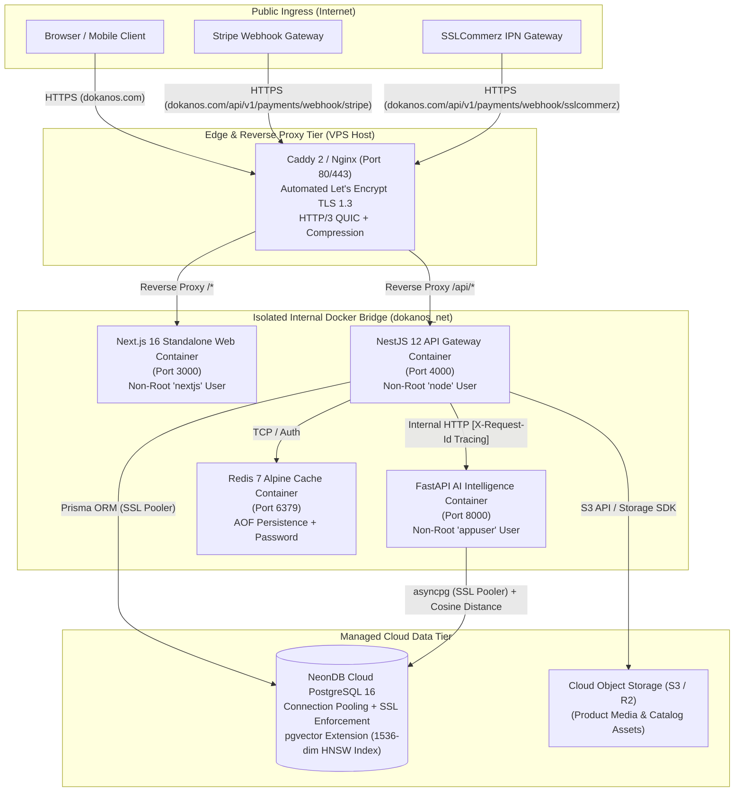

<div align="center">

# DokanOS

### Autonomous AI-Powered Multi-Tenant Commerce Operating System

An enterprise-grade, polyglot commerce platform combining high-throughput marketplace operations with an autonomous AI microservice (RAG Shopping Assistant, pgvector semantic search, and Seller Copilot).

[](https://github.com/shahariarshawon/DokanOS/actions/workflows/ci.yml)
[](https://github.com/shahariarshawon/DokanOS/actions/workflows/deploy.yml)
[](https://nextjs.org/)
[](https://nestjs.com/)
[](https://fastapi.tiangolo.com/)
[](https://github.com/pgvector/pgvector)
[](https://www.docker.com/)
[](https://jestjs.io/)

[Architecture](#system-architecture) • [Features](#key-capabilities) • [Quickstart](#local-development-quickstart) • [Docker Production](#production-container-deployment) • [API Docs](#api-documentation) • [Portfolio Showcase](#portfolio-highlights)

</div>

---

## Executive Overview

**DokanOS** bridges traditional multi-vendor marketplace friction with autonomous artificial intelligence. Rather than treating AI as a superficial chatbot wrapper, DokanOS tightly integrates 1536-dimensional semantic vector embeddings directly within the core relational database (**NeonDB PostgreSQL + pgvector**), enabling:

- **Conversational RAG Shopping Assistant:** Real-time semantic product discovery with hybrid keyword search, price constraints, and guaranteed relational fallback during microservice degradation.
- **Autonomous Seller Copilot:** Automated generation of SEO metadata, product copywriting, and categorized product attributes.
- **Atomic Multi-Vendor Checkout:** Inventory decrement and commission distribution executed inside transactional boundaries (`Prisma.$transaction`) with automated stock replenishment on cancellations.
- **Real-Time Telemetry & BI Dashboard:** WebSocket event streaming (`Socket.IO` + Redis adapter) powering interactive analytics for both vendor earnings and platform-level GMV take-rate tracking.

---

## System Architecture

DokanOS operates as a **modular monolith core API** paired with an **isolated AI vector microservice** behind an edge reverse proxy:



### Architectural Highlights

- **Zero Public Surface for AI & Cache:** The `ai-service` and `redis` containers have no host port bindings. They communicate exclusively over the internal bridge network (`dokanos_net`), secured via `AI_INTERNAL_KEY`.
- **Stateless App Containers:** Both `web` and `api` run as non-root containers with minimal memory footprints, enabling effortless horizontal scaling.
- **Graceful Relational Degradation:** If the FastAPI microservice times out or exceeds latency thresholds, the API automatically falls back to indexed relational SQL search with zero customer-facing downtime.

---

## Key Capabilities

### 1. Multi-Tenant Vendor Marketplace Core

- **Storefront & Catalog Management:** Sellers configure custom storefronts, categories, SKUs, inventory thresholds, and multi-tier attributes.
- **Strict Role-Based Access Control (RBAC):** Hierarchical guards (`CUSTOMER`, `SELLER`, `ADMIN`) preventing cross-store catalog mutation and unauthorized order inspection.
- **Atomic Multi-Store Cart & Checkout:** Unified shopping cart spanning products from multiple independent stores, calculating vendor splits, shipping, and platform commissions atomically.

### 2. Autonomous AI Vector Intelligence

- **RAG Shopping Assistant (`POST /api/v1/ai/chat`):** Natural language shopping assistant extracting intent (budget limits, category, specs) and performing cosine-similarity searches across product embeddings.
- **Seller Copywriting Copilot (`POST /api/v1/ai/copywrite`):** Generates high-converting marketing descriptions, bullet features, and SEO tags from minimal seller input.
- **Pgvector Composite Recommendations (`GET /api/v1/ai/recommendations/:id`):** 1536-dimensional embedding similarity blended with category and rating signals for intelligent cross-selling.

### 3. Financial Infrastructure & Dual Payment Gateways

- **Stripe Integration:** Dynamic PaymentIntent generation, client-secret issuance, and cryptographically verified webhook event processing (`payment_intent.succeeded`).
- **SSLCommerz Integration:** Session initiation, redirect gateways, and Instant Payment Notification (IPN) webhook handling for South Asian commerce.
- **Inventory Reconciliation:** Auto-cancels abandoned checkout holds and automatically restores product inventory on payment cancellation.

### 4. Real-Time Telemetry & Business Intelligence

- **Live Event Ingestion (`POST /api/v1/analytics/events`):** High-throughput tracking for `PRODUCT_VIEW`, `CART_ADD`, and `PURCHASE` events.
- **Seller Analytics Dashboard:** Real-time Gross Sales, Net Revenue, Orders, Conversion Rate, and AOV charts powered by Recharts.
- **Admin Marketplace Intelligence:** Platform GMV, vendor growth trajectories, and net commission take-rate reporting.

---

## Technology Stack

| Layer                 | Technologies                                                                           | Architectural Purpose                                                               |
| :-------------------- | :------------------------------------------------------------------------------------- | :---------------------------------------------------------------------------------- |
| **Frontend**          | Next.js 16 (App Router), React 19, TypeScript, Tailwind CSS v4, Lucide Icons, Recharts | Server-rendered storefront, client dashboards, standalone container build           |
| **Backend API**       | NestJS 12, Express, Prisma ORM 6, Passport JWT, Socket.IO, Class-Validator, Swagger    | Modular monolith, transactional business logic, RBAC, WebSocket gateway             |
| **AI Microservice**   | Python 3.12, FastAPI, Uvicorn, LangChain, OpenAI / Gemini API, asyncpg                 | High-performance embedding generation, semantic vector search, LLM RAG pipeline     |
| **Database**          | PostgreSQL 16 + `pgvector`, NeonDB Serverless Pooler                                   | Single source of truth for ACID transactions & 1536-dim vector embeddings           |
| **Cache & Real-time** | Redis 7 Alpine, `@socket.io/redis-adapter`, ioredis                                    | Distributed session cache, rate limiting, and multi-instance WebSocket pub/sub      |
| **Quality & Tests**   | Jest, Playwright, Vitest, Oxlint, ESLint, Prettier, Husky, lint-staged                 | Unit testing, browser E2E flows, automated pre-commit governance                    |
| **DevOps & CI/CD**    | Docker Multi-Stage, Docker Compose, GitHub Actions, Caddy 2, GHCR                      | Automated CI test pipelines, container image building, zero-downtime VPS deployment |

---

## Local Development Quickstart

### Prerequisites

- **Node.js** >= 22.0.0
- **pnpm** >= 10.0.0 (`npm i -g pnpm`)
- **Python** >= 3.12 (for AI microservice)
- **Docker & Docker Compose** (for PostgreSQL + pgvector and Redis)

### 1. Clone & Install Dependencies

```bash
git clone https://github.com/shahariarshawon/DokanOS.git
cd DokanOS

# Install monorepo dependencies
pnpm install
```

### 2. Start Local Database & Redis (Docker)

```bash
# Starts PostgreSQL 16 with pgvector extension & Redis 7
docker compose up -d
```

### 3. Configure Environment Variables

```bash
# Backend API (.env)
cp apps/api/.env.example apps/api/.env

# AI Service (.env)
cp apps/ai-service/.env.example apps/ai-service/.env

# Web Frontend (.env)
cp apps/web/.env.example apps/web/.env.local
```

### 4. Run Prisma Migrations & Seed Database

```bash
# Push schema and generate Prisma client
pnpm --filter api exec prisma migrate dev
pnpm --filter api exec prisma db seed
```

### 5. Start the Monorepo Development Environment

```bash
# Starts Next.js Web (port 3000) and NestJS API (port 4000) via Turborepo
pnpm run dev
```

In a separate terminal, launch the Python AI microservice:

```bash
cd apps/ai-service
python -m venv venv
# On Windows: venv\Scripts\activate | On macOS/Linux: source venv/bin/activate
pip install -r requirements.txt
python main.py
```

- **Storefront & Dashboard:** `http://localhost:3000`
- **Backend API Gateway:** `http://localhost:4000/api/v1`
- **Interactive Swagger Documentation:** `http://localhost:4000/api/docs`
- **FastAPI AI Microservice:** `http://localhost:8000/docs`

---

## Production Container Deployment

DokanOS provides a production-hardened multi-container stack orchestrated via [docker-compose.prod.yml](file:///c:/Users/shaha/Desktop/portfolio-projects/DokanOS/docker-compose.prod.yml):

```bash
# 1. Copy and populate the production environment template
cp .env.production.example .env.production

# 2. Build multi-stage production Docker containers
docker compose -f docker-compose.prod.yml build

# 3. Launch stack in detached mode
docker compose -f docker-compose.prod.yml up -d

# 4. Verify container health status
docker compose -f docker-compose.prod.yml ps
```

### Automated Zero-Downtime Deployment

Every push to `main` triggers [.github/workflows/deploy.yml](file:///c:/Users/shaha/Desktop/portfolio-projects/DokanOS/.github/workflows/deploy.yml), which:

1. Builds multi-architecture images and pushes them to GitHub Container Registry (`ghcr.io`).
2. SSHs into the production VPS host.
3. Pulls new image digests and runs `npx prisma migrate deploy`.
4. Executes rolling restart via `docker compose up -d --remove-orphans`.
5. Verifies service health via `/api/v1/health`.

---

## Testing & Quality Engineering

```bash
# 1. Run Backend Unit & Service Tests (Jest)
pnpm --filter api run test:jest

# 2. Run Monorepo Linter (Turbo + ESLint + Oxlint)
pnpm run lint

# 3. Check Code Formatting Compliance (Prettier)
pnpm run format:check

# 4. Run Frontend End-to-End Tests (Playwright)
pnpm --filter web run test:e2e
```

Full details on testing strategy, test pyramid, and P0/P1 business priority flows are documented in [phase-9-testing-security.md](file:///c:/Users/shaha/Desktop/portfolio-projects/DokanOS/docs/phase-9-testing-security.md).

---

## API Documentation

Interactive OpenAPI / Swagger documentation is generated directly from TypeScript DTO decorators:

- **Swagger UI:** `http://localhost:4000/api/docs`
- **FastAPI Docs:** `http://localhost:8000/docs`
- **Postman Collection:** `docs/postman/DokanOS_API.postman_collection.json`
- **Postman Environment:** `docs/postman/DokanOS_Environment.postman_environment.json`

---

## Portfolio Highlights

A summary of core technical challenges solved in DokanOS:

- **Unified Relational & Vector Storage:** Eliminated complex dual-database sync pipelines (Elasticsearch/Pinecone + Postgres) by adopting **NeonDB `pgvector`** with 1536-dimensional HNSW indexes, executing transactional queries and vector similarity searches in a single database.
- **Race Condition & Stock Atomicity Protection:** Addressed concurrent checkout overselling by wrapping inventory balance validation, atomic stock decrements, and order line item creation inside Prisma serializable transactions.
- **Graceful AI Degradation:** Designed a circuit-breaking fallback pattern where FastAPI / LLM outages automatically transition shopping queries to indexed relational SQL searches with zero downtime.
- **Polyglot Monorepo CI/CD:** Orchestrated TypeScript and Python services under a single Turborepo workspace, enforcing automated Prettier/ESLint hooks, Jest unit tests, and GitHub Container Registry deployments.

Full resume descriptions, interview talking points, and LinkedIn showcase narratives are available in [portfolio-material.md](file:///c:/Users/shaha/Desktop/portfolio-projects/DokanOS/docs/portfolio-material.md).

---

## License

DokanOS is licensed under the [ISC License](LICENSE).

Developed by **[Al Shahariar Arafat Shawon](https://github.com/shahariarshawon)**.
