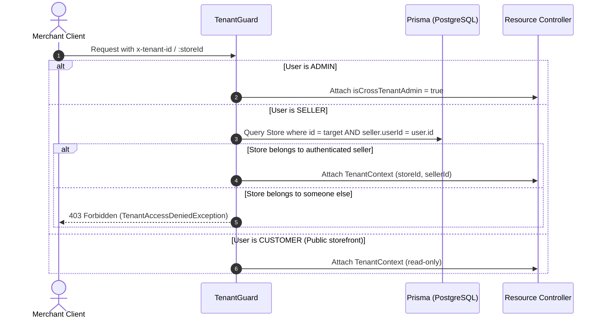

# DokanOS: REST API Specification & Endpoint Architecture

> **DokanOS Core API** — NestJS 12 Modular Monolith  
> Base URL: `http://localhost:4000/api/v1` (or via Nginx Reverse Proxy at `https://yourdomain.com/api/v1`)  
> Interactive Swagger Documentation: `http://localhost:4000/api/docs`

---

## 🔐 Authentication & Tenant Security Architecture

All protected endpoints require a Bearer token in the `Authorization` header:

```http
Authorization: Bearer <access_token>
```

### Multi-Tenant Isolation Headers & Parameters

Tenant-specific routes extract tenant identity via:

1. `x-tenant-id` header (Store UUID)
2. `:storeId` or `:storeSlug` route parameters
3. `?storeId=` or `?storeSlug=` query parameters



---

## 📋 Comprehensive Endpoint Reference

### 1. Authentication & Identity (`/auth`)

| Method | Endpoint                | Access        | Description                                                 |
| :----- | :---------------------- | :------------ | :---------------------------------------------------------- |
| `POST` | `/auth/register`        | Public        | Register customer or seller account with hashed password    |
| `POST` | `/auth/login`           | Public        | Authenticate credentials; returns access & refresh tokens   |
| `POST` | `/auth/refresh`         | Public        | Rotate refresh token and issue fresh 15-minute access token |
| `POST` | `/auth/logout`          | Authenticated | Invalidate refresh token and active session                 |
| `POST` | `/auth/forgot-password` | Public        | Send cryptographic one-time password reset token            |
| `POST` | `/auth/reset-password`  | Public        | Verify reset token and set new account password             |
| `GET`  | `/auth/verify-email`    | Public        | Activate newly registered account via verification token    |
| `GET`  | `/auth/me`              | Authenticated | Retrieve current user profile and role                      |

### 2. Multi-Tenant Stores (`/stores`)

| Method  | Endpoint                | Access         | Description                                          |
| :------ | :---------------------- | :------------- | :--------------------------------------------------- |
| `POST`  | `/stores`               | SELLER         | Create new merchant store with custom slug           |
| `GET`   | `/stores`               | Public         | List verified public stores with pagination          |
| `GET`   | `/stores/:slug`         | Public         | Get public store details, theme, and custom sections |
| `PATCH` | `/stores/:id`           | SELLER / ADMIN | Update store profile (guarded by `TenantGuard`)      |
| `PATCH` | `/stores/:id/theme`     | SELLER / ADMIN | Update store builder theme & color palette           |
| `POST`  | `/stores/:slug/follow`  | CUSTOMER       | Toggle following status for a merchant store         |
| `POST`  | `/stores/:slug/reviews` | CUSTOMER       | Submit verified merchant review and rating           |

### 3. Catalog & Products (`/products`)

| Method   | Endpoint                              | Access         | Description                                                      |
| :------- | :------------------------------------ | :------------- | :--------------------------------------------------------------- |
| `POST`   | `/products`                           | SELLER / ADMIN | Create new product SKU with variants and stock (tenant-isolated) |
| `GET`    | `/products`                           | Public         | Search and filter catalog with pricing, category, and tags       |
| `GET`    | `/products/:idOrSlug`                 | Public         | Get product details with variants, images, and reviews           |
| `GET`    | `/products/:idOrSlug/recommendations` | Public         | Retrieve pgvector cosine-distance recommendations                |
| `PATCH`  | `/products/:id`                       | SELLER / ADMIN | Update product details (ownership verified)                      |
| `POST`   | `/products/:id/duplicate`             | SELLER / ADMIN | Clone product with fresh SKU identifiers                         |
| `DELETE` | `/products/:id`                       | SELLER / ADMIN | Soft-delete / archive product listing                            |

### 4. Orders & Multi-Vendor Checkout (`/orders`)

| Method  | Endpoint             | Access         | Description                                                             |
| :------ | :------------------- | :------------- | :---------------------------------------------------------------------- |
| `POST`  | `/orders`            | Authenticated  | Atomic checkout from cart with transactional inventory deduction        |
| `GET`   | `/orders`            | Authenticated  | List all customer orders placed by the user                             |
| `GET`   | `/orders/seller`     | SELLER / ADMIN | List orders containing items for the seller's store (isolated)          |
| `GET`   | `/orders/:id`        | Authenticated  | Get order details and visual timeline                                   |
| `PATCH` | `/orders/:id/status` | SELLER / ADMIN | Update order status (`PROCESSING`, `SHIPPED`, `DELIVERED`, `CANCELLED`) |

### 5. Payments & Webhooks (`/payments`)

| Method | Endpoint                       | Access          | Description                                                        |
| :----- | :----------------------------- | :-------------- | :----------------------------------------------------------------- |
| `POST` | `/payments/create-intent`      | Authenticated   | Create Stripe PaymentIntent or SSLCommerz session                  |
| `POST` | `/payments/webhook/stripe`     | Public (Signed) | Process raw Stripe webhook events with HMAC signature verification |
| `POST` | `/payments/webhook/sslcommerz` | Public (Signed) | Process SSLCommerz IPN notification and validation                 |
| `GET`  | `/payments/history`            | Authenticated   | Get user transaction history                                       |

### 6. AI Microservice Gateway (`/ai`)

| Method | Endpoint                    | Access         | Description                                                 |
| :----- | :-------------------------- | :------------- | :---------------------------------------------------------- |
| `POST` | `/ai/chat`                  | Public         | Multi-turn RAG customer shopping assistant                  |
| `POST` | `/ai/copilot/generate-copy` | SELLER / ADMIN | Generate title, description, and SEO metadata from keywords |
| `POST` | `/ai/copilot/analyze-image` | SELLER / ADMIN | Vision AI analysis for style, category, and attributes      |
| `POST` | `/ai/recommendations`       | Public         | Semantic vector search query over pgvector embeddings       |

### 7. Enterprise Admin Control Center (`/admin`)

| Method  | Endpoint                          | Access | Description                                                      |
| :------ | :-------------------------------- | :----- | :--------------------------------------------------------------- |
| `GET`   | `/admin/users`                    | ADMIN  | List and search all platform users with role filters             |
| `PATCH` | `/admin/users/:id/status`         | ADMIN  | Update user status (`ACTIVE`, `SUSPENDED`, `DELETED`)            |
| `PATCH` | `/admin/users/:id/role`           | ADMIN  | Change user role (`CUSTOMER`, `SELLER`, `ADMIN`)                 |
| `GET`   | `/admin/sellers`                  | ADMIN  | List merchant verification queue with status filters             |
| `PATCH` | `/admin/sellers/:id/verification` | ADMIN  | Approve (`VERIFIED`) or reject (`REJECTED`) merchant KYC         |
| `GET`   | `/admin/stores`                   | ADMIN  | List all platform stores with moderation status                  |
| `PATCH` | `/admin/stores/:id/moderation`    | ADMIN  | Suspend or reinstate store status                                |
| `GET`   | `/admin/payments`                 | ADMIN  | Payment monitoring metrics, gross volume, and settlement ledger  |
| `GET`   | `/admin/ai-usage`                 | ADMIN  | Monitor LLM token counts, costs in USD, and invocation breakdown |
| `GET`   | `/admin/audit-logs`               | ADMIN  | Query immutable enterprise audit log trail                       |
| `GET`   | `/admin/feature-flags`            | ADMIN  | List all configurable platform feature flags                     |
| `PATCH` | `/admin/feature-flags/:key`       | ADMIN  | Toggle feature flag status with live hot-reload                  |
| `GET`   | `/feature-flags`                  | Public | Public read-only endpoint for active platform feature flags      |
