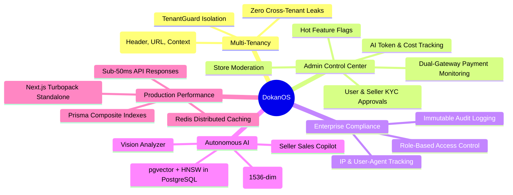

# DokanOS: End-to-End Enterprise Demo & Walkthrough Guide

> **DokanOS** — Production-Ready AI-Powered Multi-Tenant Commerce Platform  
> Complete interactive walkthrough script for enterprise technical evaluations, system design presentations, and portfolio demonstrations.

---

## 🚀 Quick Start / Demo Environment Setup

Before starting the walkthrough, ensure services are started:

```bash
# Start backend API and Frontend
pnpm dev

# Or start full production multi-container stack via Docker Compose
docker compose -f docker-compose.prod.yml up -d
```

### Verified Demo Accounts & Roles

| Role                       | Email                  | Password           | Permissions & Scope                                                                                                |
| :------------------------- | :--------------------- | :----------------- | :----------------------------------------------------------------------------------------------------------------- |
| **Super Admin**            | `admin@dokanos.com`    | `AdminPass123!`    | Global marketplace oversight, cross-tenant auditing, seller approvals, payment monitoring, AI usage, feature flags |
| **Seller A (Authorized)**  | `seller@applezone.com` | `SellerPass123!`   | Store: `apple-zone` — Catalog, AI Copilot, Inventory, Orders                                                       |
| **Seller B (Independent)** | `seller@gadgethub.com` | `SellerPass123!`   | Store: `gadget-hub` — Isolated tenant data                                                                         |
| **Customer**               | `customer@example.com` | `CustomerPass123!` | Public storefront, AI Assistant, Cart, Orders, Reviews                                                             |

---

## 🎯 Flow 1: Customer Journey (AI Discovery to Atomic Checkout)

### Step 1.1: Natural Language Semantic Discovery

1. Navigate to the storefront at `http://localhost:3000/products` or click **Storefront** in the navigation bar.
2. In the top marketplace search bar or the floating **Ask AI Shopping Assistant** widget:
   - Query: _"I need high-performance noise-canceling headphones for remote meetings"_
3. **Under the Hood (What's Happening):**
   - The Next.js frontend calls `/api/v1/ai/chat` (or internal microservice proxy).
   - The query is vectorized into a 1536-dimensional float embedding using Google Gemini / text-embedding models.
   - NeonDB PostgreSQL executes an HNSW cosine-distance query over the `ProductEmbedding` table.
   - If the AI microservice is degraded, an automatic fallback queries indexed ILIKE relational SQL fields with zero UI disruption.
4. The assistant responds with ranked product cards showing price, real-time stock availability, and vendor credentials.

### Step 1.2: Inspecting Product Detail & Dynamic SEO

1. Click on any product card (e.g. _AirPods Max Space Gray_ at `/products/prod-1`).
2. Notice:
   - **Dynamic Metadata & Title**: Title updates dynamically to `AirPods Max Space Gray | DokanOS`.
   - **Schema.org Structured Data**: View page source (`Ctrl+U` or inspect element) to see the rich `<script type="application/ld+json">` containing `@type: "Product"`, SKU, offer currency, seller organization, and aggregate rating.
   - **Accessibility & Contrast**: Tab through the options (Variant selector, quantity stepper, "Add to Cart") using keyboard only (`Tab`, `Space`, `Enter`). Notice high-contrast focus rings and `aria-label` tags.

### Step 1.3: Multi-Vendor Cart & Atomic Checkout

1. Add an item from Store A (_Apple Zone_) and an item from Store B (_Gadget Hub_).
2. Click the cart icon in the navbar (or press `header-cart-btn`). Both items appear in the unified multi-store cart.
3. Proceed to `/checkout`.
4. Enter shipping details and select payment gateway:
   - **Stripe**: Credit / Debit card processing with client secret creation.
   - **SSLCommerz**: Local sandbox mobile banking (bKash / Nagad / Rocket).
5. Submit Order:
   - DokanOS executes stock validation and inventory deduction inside an atomic `Prisma.$transaction`.
   - Dedicated `OrderItem` records are partitioned by `storeId` so each vendor only sees their own fulfillment line items.
6. The confirmation screen displays the generated order number (e.g., `DKN-2026-0089`) with timeline tracking (`PENDING` → `PAID`).

---

## 🏪 Flow 2: Seller Operations (Store Builder, AI Copilot & Telemetry)

### Step 2.1: Storefront Customization & Multi-Tenant Isolation

1. Navigate to `http://localhost:3000/dashboard` and ensure the view is toggled to **Seller Dashboard**.
2. Click the **Store Builder** tab.
3. Review the isolated tenant configuration:
   - Store Slug: `/store/apple-zone`
   - Store Branding: Theme primary color, banner image, custom description.
4. **Tenant Isolation Verification (Seller A vs Seller B):**
   - When Seller A accesses their catalog, the backend query filters `where: { sellerProfile: { userId } }`.
   - If Seller A attempts to send an `x-tenant-id` header targeting Seller B's store ID, `TenantGuard` immediately intercepts the request and throws a `403 Forbidden` (`TenantAccessDeniedException`).

### Step 2.2: Autonomous AI Product Copilot

1. Under Seller Dashboard, click **Add Product** (or **AI Sales Copilot** tab).
2. Enter rough keywords: _"ultra-light titanium mechanical watch water resistant"_.
3. Click **Generate with AI Copilot**:
   - The LLM writes an SEO-optimized product title, structured technical specifications, and persuasive marketing copy.
4. Upload a product photograph:
   - The Vision AI Analyzer inspects the image, automatically predicting category tags and visual attributes.
5. Save the product: The product is immediately indexed in PostgreSQL, and background embeddings are generated for vector search.

### Step 2.3: Real-Time Sales Telemetry & Inventory Intelligence

1. Navigate to the **Inventory** and **Analytics** tabs.
2. Review:
   - Inventory health warnings: Automatic `STOCK_LOW` badge when available quantity is below the threshold.
   - Inventory transactions ledger: Every order deduction and restock is logged with timestamp and user attribution.
   - AI Business Insights: Actionable cards alerting on revenue trends, stockout risks, and price optimization suggestions.

---

## 🛡️ Flow 3: Super Admin Governance & Control Center

### Step 3.1: Accessing the Enterprise Admin Control Center

1. On `/dashboard`, click the toggle button in the top bar: **Admin Intelligence**.
2. The UI mounts the full **Enterprise Admin Control Center** component (`AdminControlCenter`).
3. View the global KPI banner:
   - Registered Tenants count
   - Pending Seller verification requests
   - Total AI Invocations executed across the platform
   - Active Feature Flags ratio

### Step 3.2: User Management & Merchant Approvals (Tab 1)

1. In the **Users & Merchant Approvals** tab:
   - Search users by email or filter by role (`CUSTOMER`, `SELLER`, `ADMIN`).
   - Click **Verify** or **Reject** on pending seller profiles.
   - Toggle account status between `ACTIVE` and `SUSPENDED` with instant audit recording.

### Step 3.3: Tenant Store Moderation (Tab 2)

1. In the **Tenant Store Moderation** tab:
   - Inspect all stores across the marketplace.
   - Click **View Storefront** to inspect public tenant branding.
   - Click **Suspend Store** or **Reinstate Store** to regulate marketplace compliance.

### Step 3.4: Payment Gateway & Escrow Monitoring (Tab 3)

1. In the **Payment & Gateway Monitoring** tab:
   - View Total Gross Processed volume, Completed vs Failed transaction counts, and Failure Rate %.
   - Inspect the volume split: Stripe Volume (Credit Cards, Apple Pay) vs SSLCommerz Volume (bKash, Nagad).
   - Review the **Real-Time Payment Settlement Ledger** table displaying Transaction IDs, Order IDs, provider badges, amounts, and statuses.
   - Click **Export Ledger CSV** to generate financial reconciliation exports.

### Step 3.5: AI Token & Cost Telemetry (Tab 4)

1. In the **AI Token & Cost Monitoring** tab:
   - Inspect total LLM invocations, total tokens processed, and estimated API expenses in USD.
   - View per-feature cost breakdown (`shopping_assistant_rag`, `seller_sales_copilot`, `product_optimizer`, `vision_analyzer`).
   - Review the live stream of recent AI calls with actor emails, token counts, and microsecond timestamps.

### Step 3.6: Immutable Audit Trail & Compliance (Tab 5)

1. In the **Audit & Compliance Trail** tab:
   - Filter logs by action type (`ADMIN_ACTION`, `ORDER_CREATED`, `PAYMENT_PROCESSED`, `STORE_UPDATED`).
   - Every administrative modification (seller approval, store suspension, feature toggle) is permanently recorded with actor identity, IP address, and timestamp.

### Step 3.7: Feature Flags Dynamic Hot-Toggling (Tab 6)

1. In the **Feature Flags Manager** tab:
   - View flags categorized by `AI_FEATURES`, `PREMIUM_TOOLS`, and `EXPERIMENTAL`.
   - Click any reactive toggle switch (e.g. `AI_COPILOT` or `FRAUD_DETECTION_AUTO_LOCK`).
   - The flag state updates live via `PATCH /admin/feature-flags/:key` and records an immutable audit log entry without requiring code redeployment.

---

## 📊 Summary of Architectural Achievements


