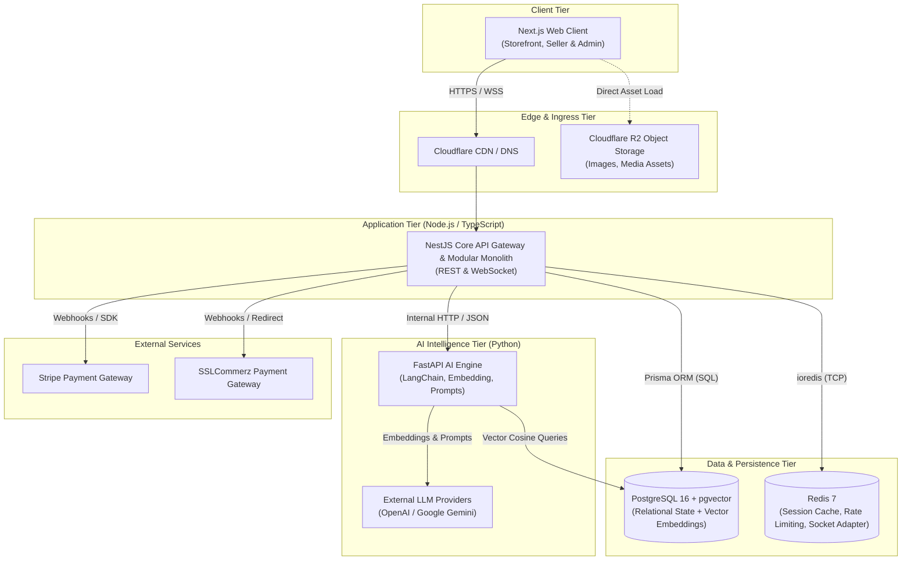
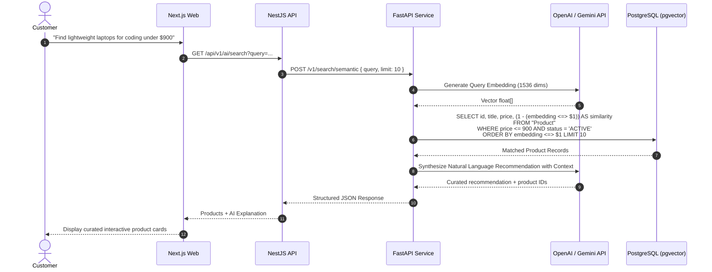
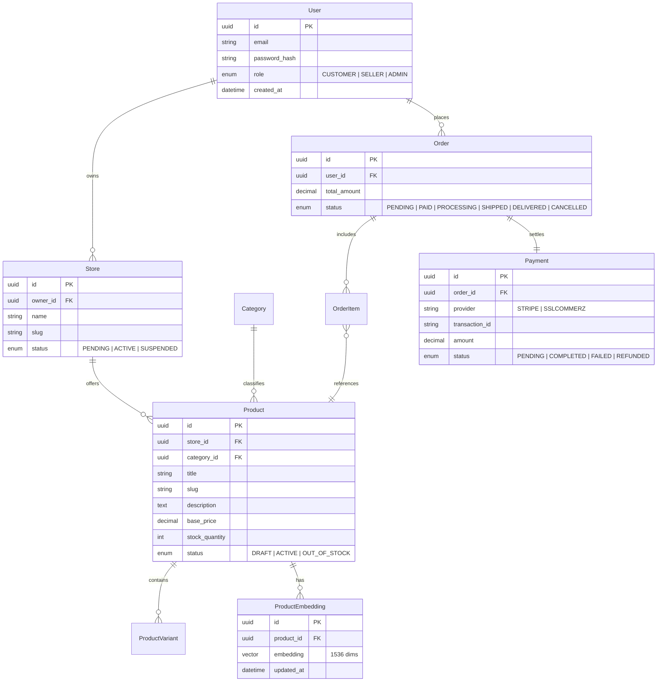
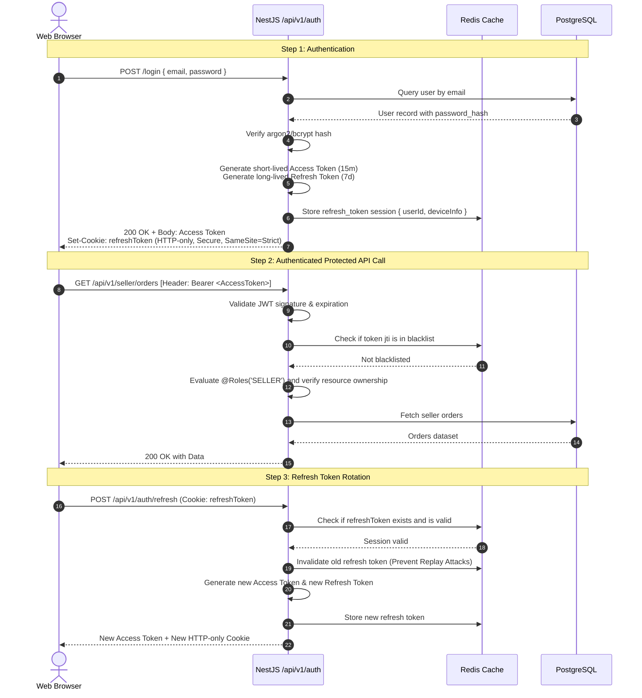
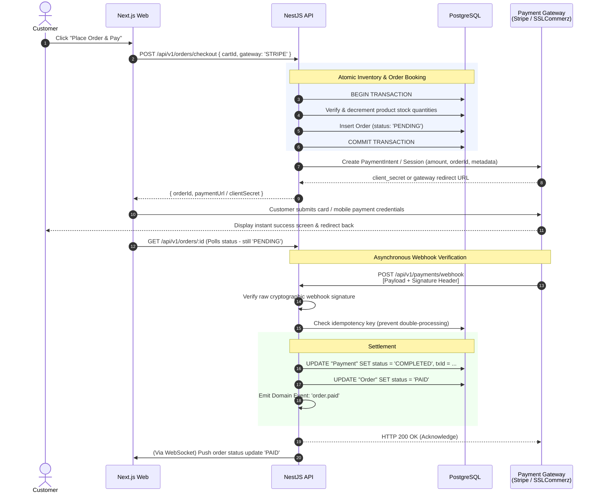
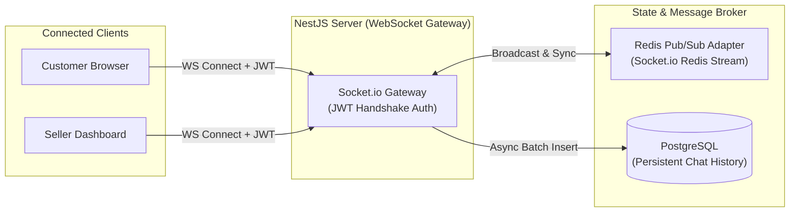
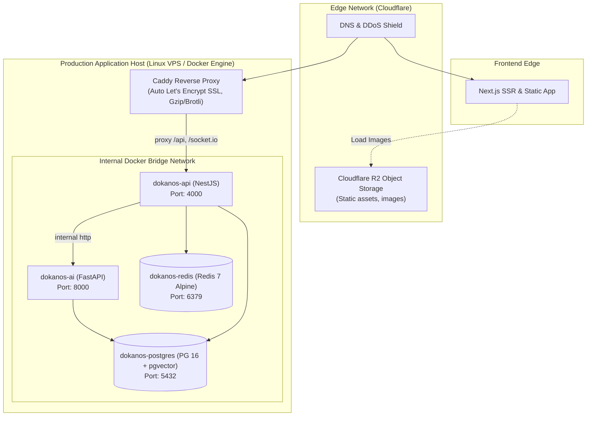

# DokanOS System Architecture Document

> **Status:** Active Reference Architecture  
> **Version:** 1.0.0  
> **Author:** DokanOS Engineering Team  
> **Target Audience:** Developers, Technical Recruiters, Software Architects, and AI Coding Agents

---

## 1. Executive System Overview

**DokanOS** is an AI-native, multi-vendor commerce operating system designed to bridge modern full-stack web engineering, resilient marketplace mechanics, and autonomous Artificial Intelligence.

Traditional e-commerce platforms treat AI as an external novelty (simple chatbots or third-party widgets). DokanOS integrates AI directly into core commerce workflows: semantic vector product discovery, automated seller catalogue authoring, and conversational assisted checkout.

### Platform Stakeholders & Personas

| Persona | Core Responsibilities | Key Capabilities in DokanOS |
| :--- | :--- | :--- |
| **Customer** | Discovery & Purchasing | Natural language search, conversational shopping assistant, live seller chat, checkout, order tracking |
| **Seller** | Store & Inventory Management | Multi-store setup, AI-generated descriptions and SEO tags, order fulfillment, real-time customer messaging |
| **Admin** | Governance & Operations | Platform-wide user/store moderation, commission tracking, payout settlements, audit trails, system observability |

### Architectural Tenets

1. **Pragmatic Modularity:** Avoid distributed system tax. DokanOS utilizes a **Modular Monolith** for backend domain logic, keeping deployments straightforward while preserving strict isolation boundaries.
2. **Polyglot Pragmatism:** High-concurrency I/O and business workflows run on TypeScript/Node.js; deep AI, vector math, and LLM orchestration run on Python/FastAPI.
3. **Transactional Integrity as First Principle:** Marketplace financials, orders, and inventory cannot tolerate eventual consistency errors. PostgreSQL enforces strict ACID transactions.
4. **Single Source of Truth for Data & Vectors:** Vectors live adjacent to relational product data using `pgvector`, eliminating dual-write lag and synchronization headaches between separate vector databases and databases of record.

---

## 2. High-Level Architecture Diagram



### Monorepo Layout (`DokanOS/`)

```text
DokanOS/
├── apps/
│   ├── web/               # Next.js 15+ App Router frontend
│   ├── api/               # NestJS 11+ modular monolith REST & WebSocket server
│   └── ai-service/        # Python FastAPI microservice (LLMs, LangChain, RAG)
├── packages/
│   ├── tsconfig/          # Shared TypeScript configurations
│   ├── eslint-config/     # Shared linting rules
│   └── ui/                # Shared UI design tokens & primitive components
├── docs/                  # Architectural specs, API schemas, and guides
│   ├── architecture.md    # Complete system architecture documentation
│   └── database.md        # Database design, ERD, and migration guide
├── docker-compose.yml     # Local orchestration (PostgreSQL, pgvector, Redis)
├── pnpm-workspace.yaml    # Workspace definition
└── package.json           # Root scripts & Turborepo orchestration
```

---

## 3. Frontend Architecture (`apps/web`)

The frontend is built using **Next.js (App Router)** with **TypeScript** and **Tailwind CSS**. It serves as a unified, highly optimized client for Customers, Sellers, and Admins via dynamic route grouping and role-aware layouts.

### Directory Structure & Modular Separation

```text
apps/web/
├── src/
│   ├── app/
│   │   ├── (auth)/             # Login, Register, Forgot Password
│   │   ├── (storefront)/       # Customer marketplace, category browsing, product detail, cart
│   │   ├── (seller)/dashboard/ # Seller inventory, order fulfillment, store settings
│   │   ├── (admin)/console/    # Platform governance, user verification, system logs
│   │   └── api/                # Next.js BFF (Backend-For-Frontend) proxies / route handlers
│   ├── components/
│   │   ├── ui/                 # Accessible primitives (Button, Modal, Dropdown)
│   │   ├── storefront/         # ProductCard, CartDrawer, SearchFilters
│   │   ├── seller/             # ProductEditor, StockTable, AICopywriterModal
│   │   └── chat/               # FloatingAssistantDrawer, LiveVendorChat
│   ├── hooks/                  # Custom React hooks (useCart, useSocket, useDebounce)
│   ├── lib/
│   │   ├── api-client.ts       # Axios / Fetch client with automatic JWT bearer attachment
│   │   └── socket.ts           # Socket.io client instance
│   └── store/
│       ├── cart-store.ts       # Zustand lightweight client cart state
│       └── session-store.ts    # Ephemeral UI state
```

### State Management Strategy

1. **Server State (TanStack React Query):** All dynamic business data (products, orders, store stats) is managed via React Query. Features include automatic cache invalidation on mutations, optimistic UI updates (e.g., adding to cart), and background polling for order status.
2. **Client Ephemeral State (Zustand):** Lightweight client-side stores manage UI interaction states (modal states, cart drawer visibility, filter selections, active chat room).
3. **Authentication State:** Access tokens are kept in-memory or securely refreshed via secure HTTP-only cookies to protect against Cross-Site Scripting (XSS).

---

## 4. Backend Architecture (`apps/api`)

The primary backend is implemented in **NestJS** following a **Feature-Driven Modular Monolith** architecture. This enforces high cohesion within business domains and loose coupling across boundaries.

```text
apps/api/src/
├── app.module.ts              # Root composition module
├── main.ts                    # Bootstrap entry point, validation pipes, global filters
├── common/                    # Cross-cutting primitives
│   ├── decorators/            # @CurrentUser(), @Roles()
│   ├── filters/               # AllExceptionsFilter (Standardized error envelopes)
│   ├── guards/                # JwtAuthGuard, RolesGuard
│   ├── interceptors/          # TransformResponseInterceptor, LoggingInterceptor
│   └── prisma/                # PrismaModule & PrismaService
└── modules/
    ├── auth/                  # Authentication, Refresh tokens, Password hashing
    ├── users/                 # Customer and Admin account domain
    ├── stores/                # Seller store creation, KYC, store profiles
    ├── products/              # Catalog, inventory SKUs, categories, variants
    ├── orders/                # Cart checkout, order state machine, invoice generation
    ├── payments/              # Payment intent orchestration (Stripe & SSLCommerz)
    ├── ai-client/             # Internal HTTP client communicating with Python ai-service
    ├── chat/                  # WebSocket gateway for real-time seller-buyer communication
    └── notifications/         # Real-time event notifications & webhooks
```

### Standard Module Anatomy

Each module strictly isolates its domain concerns:

```text
modules/products/
├── products.module.ts         # Module declaration & dependency injection
├── products.controller.ts     # HTTP REST routes, route guards, DTO validation
├── products.service.ts        # Business rules, domain transactions, calculations
├── dto/                       # class-validator DTOs for request payloads
│   ├── create-product.dto.ts
│   └── search-product.dto.ts
├── entities/                  # TypeScript interface contracts for product entities
└── repositories/              # Specialized data queries wrapping Prisma
```

### Inter-Module Communication

- **Synchronous Operations:** Handled through direct dependency injection of service interfaces (e.g., `OrdersService` calling `ProductsService.reserveStock()`).
- **Asynchronous Domain Events:** Handled via NestJS `EventEmitter2` in-process event bus. When an order transitions to `PAID`, an `OrderPaidEvent` is emitted. The `NotificationsModule` and `AnalyticsModule` react without coupling directly to `OrdersModule`.

---

## 5. AI Service Architecture (`apps/ai-service`)

The AI engine is implemented as a specialized **FastAPI** service in Python. It encapsulates all heavy algorithmic operations, vector mathematics, LLM provider integration, and prompt engineering.

### Directory Structure

```text
apps/ai-service/
├── app/
│   ├── main.py                # FastAPI initialization, CORS, health endpoints
│   ├── core/
│   │   ├── config.py          # Environment settings (API keys, DB connection)
│   │   └── security.py        # Internal API-key verification between NestJS & FastAPI
│   ├── api/
│   │   └── v1/
│   │       ├── router.py      # Aggregated API routes
│   │       ├── search.py      # Hybrid semantic vector search endpoints
│   │       ├── assistant.py   # RAG shopping assistant endpoint
│   │       └── copilot.py     # Seller product description & SEO generator
│   ├── services/
│   │   ├── embedding.py       # Vector generation (OpenAI text-embedding-3-small)
│   │   ├── vector_store.py    # Direct pgvector SQL executor (cosine similarity)
│   │   └── rag_engine.py      # LangChain prompt builder and LLM orchestrator
│   └── schemas/
│       ├── search.py          # Pydantic input/output schemas
│       └── copilot.py         # Generation request & response schemas
├── requirements.txt
└── Dockerfile
```

### Core AI Pipelines

#### 1. Hybrid Semantic Product Search & RAG



#### 2. Seller AI Copilot

- **Input:** Seller enters raw attributes: `"cotton hoodie, oversized, unisex, minimal branding, black"`.
- **Pipeline:** FastAPI executes a structured chain using temperature-calibrated prompts:
  1. Generates persuasive, markdown-formatted product description.
  2. Generates meta-title, meta-description, and 10 high-conversion SEO tags.
  3. Suggests standardized marketplace categories.
  4. Automatically produces embedding vector for immediate indexing upon seller save.

---

## 6. Database Communication Flow & Data Model Architecture

DokanOS uses **PostgreSQL 16** with the **`pgvector`** extension enabled.



### Relational Model with Vector Proximity

- **Relational Tables:** Handled via **Prisma ORM** for type-safe schema migrations, relation loading, and declarative database constraints.
- **Vector Operations (`pgvector`):** The vector column uses `vector(1536)` (compatible with `text-embedding-3-small`). Vector search queries run via raw Prisma SQL queries (`$queryRaw`) or direct database connections from the AI service utilizing HNSW (Hierarchical Navigable Small World) indexing for $O(\log N)$ nearest neighbor latency.

```sql
-- HNSW Cosine Index for ultra-fast approximate nearest neighbor lookups
CREATE INDEX product_embedding_hnsw_idx 
ON "ProductEmbedding" 
USING hnsw (embedding vector_cosine_ops)
WITH (m = 16, ef_construction = 64);
```

---

## 7. Authentication & Authorization Flow

DokanOS implements a stateless **Dual-Token JWT Strategy** coupled with a Redis-backed token revocation list to support immediate logout and session invalidation.



### Authorization Guards

- `JwtAuthGuard`: Enforces token validity, signature, and expiration.
- `RolesGuard`: Enforces role-based hierarchy (`ADMIN` > `SELLER` > `CUSTOMER`).
- `OwnershipGuard`: Enforces that a seller can only update, delete, or inspect products, orders, and financial data belonging to their own store.

---

## 8. Payment Flow (Dual-Gateway Architecture)

DokanOS supports both **Stripe** (international credit/debit cards) and **SSLCommerz** (regional cards, mobile financial services such as bKash, Nagad, Rocket).

> [!IMPORTANT]
> **Client Payment Payloads are NEVER Trusted:** Order state transitions (`PENDING -> PAID`) occur **strictly** upon cryptographic verification of asynchronous webhooks from the payment processor.



---

## 9. Real-Time Communication Flow

DokanOS incorporates real-time bidirectional communication via **Socket.io** on the backend, integrated seamlessly with **Redis Pub/Sub** to support horizontal scaling across multiple instances.



### Real-Time Channels & Rooms

1. **Direct Seller-Customer Chat:**
   - Room ID: `chat:order_{orderId}` or `chat:store_{storeId}_user_{userId}`
   - Messages are pushed in real time (< 50ms) to the active client and asynchronously persisted to PostgreSQL.
2. **Order Lifecycle Notifications:**
   - Room ID: `user:{userId}` and `store:{storeId}`
   - Triggers live toasts on seller dashboard when a new order arrives and updates the customer tracking progress bar (`PAID -> PROCESSING -> SHIPPED`).
3. **Inventory Depletion Alerts:**
   - Real-time low-stock warning broadcasted immediately to the seller when stock drops below threshold.

---

## 10. Deployment & Infrastructure Architecture

The deployment topology is crafted to remain lean, budget-friendly for staging and portfolio verification, yet fully cloud-ready for high-traffic production workloads.



### Local Development Orchestration

The entire state layer runs with a single command via [docker-compose.yml](file:///c:/Users/shaha/Desktop/portfolio-projects/DokanOS/docker-compose.yml):

```bash
# Starts PostgreSQL (with pgvector) and Redis
docker compose up -d

# Run database migrations
pnpm --filter api prisma migrate dev

# Run all applications concurrently via Turborepo
pnpm dev
```

---

## 11. Architectural Decisions: The "Why"

This section outlines the engineering rationale behind key architectural decisions.

```
                    DokanOS Core Architecture Matrix
   ┌───────────────────────────────────────────────────────────────┐
   │                     DokanOS Monorepo                          │
   │                                                               │
   │   ┌────────────────────────┐      ┌───────────────────────┐   │
   │   │  NestJS Backend API    │◄────►│  FastAPI AI Service   │   │
   │   │  (Modular Monolith)    │ HTTP │  (Isolated Python)    │   │
   │   └───────────┬────────────┘      └───────────┬───────────┘   │
   │               │                               │               │
   │       Prisma  │ SQL                           │ SQL / Vectors │
   │               ▼                               ▼               │
   │   ┌───────────────────────────────────────────────────────┐   │
   │   │              PostgreSQL 16 + pgvector                 │   │
   │   │         (Single Unified Source of Truth)              │   │
   │   └───────────────────────────────────────────────────────┘   │
   │                               │                               │
   │                       In-Memory Caching                       │
   │                               ▼                               │
   │   ┌───────────────────────────────────────────────────────┐   │
   │   │                    Redis 7 Cache                      │   │
   │   │       (Sessions, Rate Limits, Socket Adapter)         │   │
   │   └───────────────────────────────────────────────────────┘   │
   └───────────────────────────────────────────────────────────────┘
```

---

### Why Modular Monolith?

Instead of adopting distributed microservices prematurely, DokanOS implements a **Modular Monolith** in NestJS.

1. **Elimination of Distributed System Failure Modes:** Microservices introduce network partitions, distributed transactions (Saga patterns), API contract versioning overhead, and cascading latency. For an e-commerce platform at this scale, ACID database transactions across orders, payments, and inventory are vastly superior.
2. **High Developer Velocity & Single Monorepo Refactoring:** Interfaces, DTOs, and domain logic are unified. If an order contract changes, TypeScript highlights compile-time errors across the entire codebase instantly.
3. **Clear Boundary Encasement:** Each module (`users`, `products`, `orders`) encapsulates its controllers, services, and repositories. If a specific domain (such as `orders` or `payments`) requires independent auto-scaling in the future, its module can be extracted into an independent microservice with zero rewrites to business logic.

---

### Why Separate AI Service?

The AI pipeline is intentionally isolated into an independent **FastAPI (Python)** microservice rather than executed inside the NestJS Node.js process.

1. **Python AI Ecosystem Superiority:** Python is the native lingua franca for machine learning. Libraries such as LangChain, NumPy, Pydantic AI, and native LLM SDKs receive first-party feature support and performance optimizations in Python years ahead of Node.js equivalents.
2. **Event Loop Non-Blocking Protection:** Heavy text processing, vector parsing, tokenization, and complex prompt template assembly are computationally expensive. Running them in a separate process guarantees the Node.js event loop remains dedicated to serving high-concurrency HTTP API and WebSocket requests with sub-10ms response times.
3. **Independent Resource & Compute Scaling:** The AI service can be placed on a compute-optimized instance (or serverless GPU container) that scales to zero when dormant, while the primary REST API runs on standard memory-efficient instances.

---

### Why PostgreSQL?

PostgreSQL is selected as the primary system database of record.

1. **Strict ACID Financial Compliance:** Multi-vendor operations require non-negotiable guarantees: funds transferred, commission split, order status transitioned, and inventory decremented must occur atomically or roll back completely.
2. **Complex Relational Modeling:** Marketplaces are inherently relational: `User -> Store -> Product -> Variant -> OrderItem -> Order -> Payment`. Document databases (like MongoDB) lead to manual join emulation, data duplication, and eventual consistency vulnerabilities.
3. **Structured + Unstructured Flexibility:** PostgreSQL handles structured relational data flawlessly while offering `JSONB` for flexible product attributes (e.g., custom attributes per category like shoe size vs. laptop RAM) with GIN indexing for fast querying.

---

### Why Redis?

Redis operates as an in-memory acceleration and coordination tier.

1. **High-Performance Ephemeral Storage:** Validating JWT revocations or rate limits on every single HTTP request via PostgreSQL would saturate database connection pools. Redis answers these operations in under **1 millisecond**.
2. **Distributed Locking for Payment & Inventory Concurrency:** During high-volume flash sales, Redis distributed locks (`Redlock` or atomic `SETNX`) prevent race conditions where two customers attempt to purchase the final remaining inventory item simultaneously.
3. **Horizontal Socket.io Synchronization:** When DokanOS scales to multiple API container replicas, the Redis Pub/Sub adapter guarantees that a WebSocket message sent to Server A is seamlessly delivered to a customer connected to Server B.

---

### Why pgvector?

Rather than adding a separate external vector database (such as Pinecone, Qdrant, or Milvus), DokanOS utilizes the **`pgvector`** extension directly inside PostgreSQL.

1. **Elimination of Dual-Write Synchronization Bugs:** With a separate vector database, every time a seller updates a product's price, title, or availability, the backend must write to Postgres, write to the vector DB, and handle failure if either write fails. In `pgvector`, the embedding vector lives right on the `ProductEmbedding` record—updated atomically in the same database transaction.
2. **Combined Relational + Vector Filtering in a Single Query:** Standalone vector databases struggle with complex metadata pre-filtering (e.g., *"Only search products with similarity > 0.8 that are IN STOCK, priced UNDER $50, located in STORE X, and created in the LAST 30 DAYS"*). In PostgreSQL, vector similarity operators (`<=>`, `<#>`) blend directly with standard SQL `WHERE` clauses in one optimized execution plan.
3. **Dramatic Operational Cost & Simplicity Reduction:** Eliminates additional cloud vendor bills, network hops, dedicated API keys, and maintenance overhead. One database covers relational data, JSONB documents, and high-dimensional semantic search.

---

## 12. Security Architecture & Threat Mitigation

| Threat Vector | Mitigation Strategy in DokanOS |
| :--- | :--- |
| **Broken Object Level Authorization (BOLA / IDOR)** | Strict NestJS `OwnershipGuard` verifies `store.owner_id === request.user.id` on every mutation. |
| **Payment Tampering & Man-in-the-Middle** | Client amounts are ignored; order amounts are computed strictly on the backend. Order status transitions only via cryptographically signed webhooks. |
| **SQL & Prompt Injection** | SQL injection is blocked via Prisma parameterized queries; LLM prompt injection is mitigated by strict Pydantic output parsers and system prompt fencing. |
| **Token Theft / XSS** | Refresh tokens reside exclusively in `HTTP-only`, `Secure`, `SameSite=Strict` cookies inaccessible to JavaScript. |
| **DDoS & Brute Force** | Redis sliding-window rate limiting applied per IP on public auth endpoints (`/auth/login`, `/auth/register`) and AI endpoints. |

---

## 13. Summary & Verification Matrix

| Capability | Module / Component | Primary Technology |
| :--- | :--- | :--- |
| **Unified Monorepo** | Root | Turborepo + PNPM Workspaces |
| **Client Application** | `apps/web` | Next.js 15, React Query, Zustand, Tailwind CSS |
| **Core API Gateway** | `apps/api` | NestJS 11, TypeScript, Prisma ORM |
| **AI & Vector Engine** | `apps/ai-service` | Python 3.12, FastAPI, LangChain, OpenAI / Gemini |
| **Database & Search** | Local / Cloud | PostgreSQL 16 + `pgvector` extension |
| **Caching & Messaging** | Local / Cloud | Redis 7 Alpine |
| **Asset Storage** | Cloud Edge | Cloudflare R2 |
