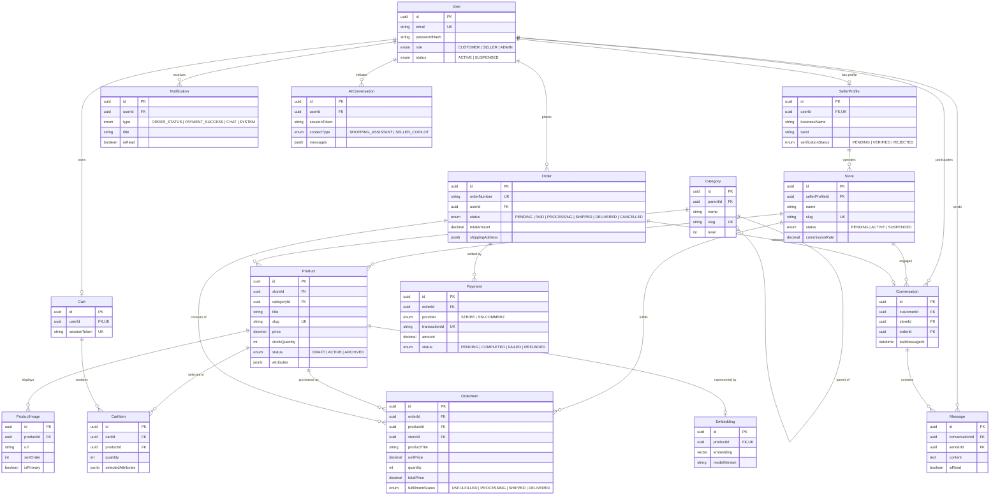

# DokanOS Database Architecture Specification

> **Status:** Canonical Database Design  
> **Database Engine:** PostgreSQL 16+ (with `pgvector` extension)  
> **Object-Relational Mapping (ORM):** Prisma 5+ / 6+  
> **Target Audience:** Backend Engineers, Database Administrators, System Architects, AI Coding Agents

---

## 1. Executive Overview & Architecture Principles

The DokanOS persistence layer is architected as an **ACID-compliant, relational data store with integrated vector search**.

Multi-vendor commerce platforms introduce unique transactional challenges:

1. **Multi-Store Basket Isolation & Payouts:** A single customer checkout can contain line items from different sellers, each requiring independent fulfillment tracking, commission deduction, and payment settlement.
2. **Immutable Audit Trails:** Product prices, titles, and SKUs change over time; order history must remain mathematically immutable to preserve invoice integrity and tax compliance.
3. **Unified Relational & Vector Semantics:** Instead of routing product searches to an external, out-of-sync vector database, vector embeddings live inside PostgreSQL via `pgvector`, allowing atomic single-query hybrid search (relational SQL filters + cosine vector distance).

### Core Architectural Decisions

- **UUID Primary Keys (v4/v7):** Prevents sequential enumeration attacks on sensitive marketplace entities (orders, invoices, user accounts) and simplifies distributed database replication.
- **Strict Referential Integrity with Declarative Cascades:** Explicit `ON DELETE CASCADE` or `ON DELETE RESTRICT` guarantees no orphaned records while preventing accidental deletion of financial records.
- **Monetary Precision via `Decimal(12, 2)`:** Floats are strictly prohibited for prices, commissions, and balances to eliminate floating-point arithmetic errors.

---

## 2. Entity-Relationship (ER) Diagram



---

## 3. Detailed Entity Specifications

### 3.1. `User`

- **Purpose:** Primary identity table for authentication, account management, and role-based permissions across customers, sellers, and administrators.
- **Fields:**
  - `id`: `UUID` (PK, default `gen_random_uuid()`)
  - `email`: `String` (Unique, indexed, normalized lowercase)
  - `passwordHash`: `String` (Argon2id/Bcrypt hash string; nullable for social OAuth logins)
  - `firstName`: `String` (Max 100)
  - `lastName`: `String` (Max 100)
  - `phone`: `String?` (E.164 formatted telephone number)
  - `avatarUrl`: `String?` (Stored on Cloudflare R2)
  - `role`: `Enum` (`CUSTOMER`, `SELLER`, `ADMIN`, default `CUSTOMER`)
  - `status`: `Enum` (`ACTIVE`, `SUSPENDED`, `DELETED`, default `ACTIVE`)
  - `emailVerifiedAt`: `DateTime?`
  - `createdAt`: `DateTime` (default `now()`)
  - `updatedAt`: `DateTime` (`@updatedAt`)
- **Relationships:**
  - `1-to-0..1` with `SellerProfile` (Cascade on delete)
  - `1-to-0..1` with `Cart` (Cascade on delete)
  - `1-to-many` with `Order` (Restrict on delete)
  - `1-to-many` with `Notification` (Cascade on delete)
  - `1-to-many` with `Message` (Restrict on delete to preserve audit records)
  - `1-to-many` with `Conversation` as customer (Restrict on delete)
  - `1-to-many` with `AIConversation` (Set null on delete for anonymous retention)
- **Constraints:**
  - Unique: `email`
  - Index: `[role, status]`, `createdAt`

---

### 3.2. `SellerProfile`

- **Purpose:** Stores legal, KYC (Know Your Customer), tax, and banking details of a verified marketplace merchant.
- **Fields:**
  - `id`: `UUID` (PK)
  - `userId`: `UUID` (FK to `User.id`, unique)
  - `businessName`: `String` (Legal registered company name)
  - `businessRegistrationNumber`: `String?`
  - `taxId`: `String?` (VAT/TIN number)
  - `bankName`: `String?`
  - `bankAccountNumber`: `String?` (Encrypted or masked for display)
  - `bankRoutingNumber`: `String?`
  - `verificationStatus`: `Enum` (`PENDING`, `VERIFIED`, `REJECTED`, default `PENDING`)
  - `rejectedReason`: `String?`
  - `verifiedAt`: `DateTime?`
  - `createdAt`: `DateTime`
  - `updatedAt`: `DateTime`
- **Relationships:**
  - `1-to-1` with `User`
  - `1-to-many` with `Store` (Restrict on delete)
- **Constraints:**
  - Unique: `userId`
  - Index: `verificationStatus`

---

### 3.3. `Store`

- **Purpose:** Represents the customer-facing storefront/vendor profile. A seller profile can manage one or more stores.
- **Fields:**
  - `id`: `UUID` (PK)
  - `sellerProfileId`: `UUID` (FK to `SellerProfile.id`)
  - `name`: `String` (Store title)
  - `slug`: `String` (Unique, URL slug e.g. `tech-haven`)
  - `description`: `Text?` (Store bio / policies)
  - `logoUrl`: `String?` (R2 CDN URL)
  - `bannerUrl`: `String?` (R2 CDN URL)
  - `status`: `Enum` (`PENDING`, `ACTIVE`, `SUSPENDED`, default `PENDING`)
  - `commissionRate`: `Decimal(5, 2)` (Default platform commission e.g. `10.00`%)
  - `rating`: `Decimal(3, 2)` (Aggregated review score, default `0.00`)
  - `reviewCount`: `Int` (Default `0`)
  - `createdAt`: `DateTime`
  - `updatedAt`: `DateTime`
- **Relationships:**
  - `Many-to-1` with `SellerProfile`
  - `1-to-many` with `Product` (Restrict on delete)
  - `1-to-many` with `OrderItem` (Restrict on delete)
  - `1-to-many` with `Conversation` (Restrict on delete)
- **Constraints:**
  - Unique: `slug`
  - Index: `[status, rating]`, `sellerProfileId`

---

### 3.4. `Category`

- **Purpose:** Self-referencing hierarchical taxonomy for marketplace catalog classification.
- **Fields:**
  - `id`: `UUID` (PK)
  - `parentId`: `UUID?` (FK to `Category.id`, nullable for top-level roots)
  - `name`: `String` (Max 100)
  - `slug`: `String` (Unique, URL slug e.g. `laptops-and-notebooks`)
  - `description`: `Text?`
  - `iconUrl`: `String?`
  - `level`: `Int` (0 for root, 1 for subcategory, 2 for leaf)
  - `isActive`: `Boolean` (default `true`)
  - `createdAt`: `DateTime`
  - `updatedAt`: `DateTime`
- **Relationships:**
  - `Many-to-1` self-relation `parent` (`Category`)
  - `1-to-many` self-relation `children` (`Category[]`)
  - `1-to-many` with `Product`
- **Constraints:**
  - Unique: `slug`
  - Index: `[parentId, isActive]`, `level`

---

### 3.5. `Product`

- **Purpose:** Primary marketplace merchandise listing with pricing, inventory tracking, and dynamic metadata.
- **Fields:**
  - `id`: `UUID` (PK)
  - `storeId`: `UUID` (FK to `Store.id`)
  - `categoryId`: `UUID` (FK to `Category.id`)
  - `title`: `String` (Max 255, indexed for text search)
  - `slug`: `String` (Unique, e.g. `macbook-pro-m3-16gb`)
  - `description`: `Text` (Markdown/HTML body)
  - `sku`: `String?` (Unique per store, inventory stock-keeping unit)
  - `barcode`: `String?` (UPC/EAN)
  - `price`: `Decimal(12, 2)` (Active selling price)
  - `compareAtPrice`: `Decimal(12, 2)?` (Original/MSRP strike-through price)
  - `costPrice`: `Decimal(12, 2)?` (Wholesale cost, visible only to seller)
  - `stockQuantity`: `Int` (Current inventory available, default `0`)
  - `lowStockThreshold`: `Int` (Default `5`)
  - `status`: `Enum` (`DRAFT`, `ACTIVE`, `OUT_OF_STOCK`, `ARCHIVED`, default `DRAFT`)
  - `attributes`: `JsonB` (Structured dynamic specs e.g. `{"color": "Space Gray", "ram": "16GB", "storage": "512GB"}`)
  - `isFeatured`: `Boolean` (default `false`)
  - `rating`: `Decimal(3, 2)` (Aggregated score, default `0.00`)
  - `reviewCount`: `Int` (Default `0`)
  - `createdAt`: `DateTime`
  - `updatedAt`: `DateTime`
- **Relationships:**
  - `Many-to-1` with `Store`
  - `Many-to-1` with `Category`
  - `1-to-many` with `ProductImage` (Cascade on delete)
  - `1-to-many` with `CartItem` (Cascade on delete)
  - `1-to-many` with `OrderItem` (Restrict on delete)
  - `1-to-0..1` with `Embedding` (Cascade on delete)
- **Constraints:**
  - Unique: `slug`
  - Unique: `[storeId, sku]`
  - Check: `price >= 0`, `stockQuantity >= 0`
  - Index: `[storeId, status]`, `[categoryId, status]`, `price`, `createdAt`

---

### 3.6. `ProductImage`

- **Purpose:** Ordered visual gallery assets for products stored on Cloudflare R2.
- **Fields:**
  - `id`: `UUID` (PK)
  - `productId`: `UUID` (FK to `Product.id`)
  - `url`: `String` (R2 asset URL)
  - `altText`: `String?`
  - `sortOrder`: `Int` (Zero-indexed display sequence, default `0`)
  - `isPrimary`: `Boolean` (Hero thumbnail indicator, default `false`)
  - `createdAt`: `DateTime`
- **Relationships:**
  - `Many-to-1` with `Product` (Cascade on delete)
- **Constraints:**
  - Index: `[productId, sortOrder]`

---

### 3.7. `Cart`

- **Purpose:** Active shopping basket for registered users or anonymous guest visitors.
- **Fields:**
  - `id`: `UUID` (PK)
  - `userId`: `UUID?` (FK to `User.id`, unique, nullable for guest checkout)
  - `sessionToken`: `String?` (Unique UUID for guest tracking via cookie)
  - `createdAt`: `DateTime`
  - `updatedAt`: `DateTime`
- **Relationships:**
  - `1-to-1` with `User`
  - `1-to-many` with `CartItem` (Cascade on delete)
- **Constraints:**
  - Unique: `userId`
  - Unique: `sessionToken`

---

### 3.8. `CartItem`

- **Purpose:** Individual product entry inside a user's shopping basket.
- **Fields:**
  - `id`: `UUID` (PK)
  - `cartId`: `UUID` (FK to `Cart.id`)
  - `productId`: `UUID` (FK to `Product.id`)
  - `quantity`: `Int` (Check `quantity > 0`, default `1`)
  - `selectedAttributes`: `JsonB?` (Chosen variant options e.g. `{"size": "XL", "color": "Navy"}`)
  - `createdAt`: `DateTime`
  - `updatedAt`: `DateTime`
- **Relationships:**
  - `Many-to-1` with `Cart` (Cascade on delete)
  - `Many-to-1` with `Product` (Cascade on delete)
- **Constraints:**
  - Unique: `[cartId, productId, selectedAttributes]` (via expression or application key)
  - Check: `quantity > 0`
  - Index: `cartId`, `productId`

---

### 3.9. `Order`

- **Purpose:** Master financial document and fulfillment state machine for a customer purchase.
- **Fields:**
  - `id`: `UUID` (PK)
  - `orderNumber`: `String` (Unique readable identifier, e.g. `DOK-2026-89412`)
  - `userId`: `UUID` (FK to `User.id`)
  - `status`: `Enum` (`PENDING`, `PAID`, `PROCESSING`, `SHIPPED`, `DELIVERED`, `CANCELLED`, `REFUNDED`, default `PENDING`)
  - `subtotal`: `Decimal(12, 2)` (Sum of item totals)
  - `taxAmount`: `Decimal(12, 2)` (Sales tax/VAT, default `0.00`)
  - `shippingAmount`: `Decimal(12, 2)` (Delivery fee, default `0.00`)
  - `discountAmount`: `Decimal(12, 2)` (Coupon/voucher deduction, default `0.00`)
  - `totalAmount`: `Decimal(12, 2)` (Final payable charge)
  - `currency`: `String` (ISO 4217, default `'USD'`, supports `'BDT'`)
  - `shippingAddress`: `JsonB` (Snapshot of recipient name, street, city, postal code, phone)
  - `billingAddress`: `JsonB` (Snapshot of tax billing address)
  - `customerNote`: `Text?`
  - `placedAt`: `DateTime` (default `now()`)
  - `updatedAt`: `DateTime`
- **Relationships:**
  - `Many-to-1` with `User`
  - `1-to-many` with `OrderItem` (Cascade on delete restricted to administrative wipe; line items are permanent)
  - `1-to-many` with `Payment`
  - `1-to-0..1` with `Conversation`
- **Constraints:**
  - Unique: `orderNumber`
  - Check: `totalAmount >= 0`
  - Index: `[userId, status]`, `placedAt`, `orderNumber`

---

### 3.10. `OrderItem`

- **Purpose:** Immutable line items of an order. Crucially, it snapshots product details at purchase time and attributes revenue to specific stores.
- **Fields:**
  - `id`: `UUID` (PK)
  - `orderId`: `UUID` (FK to `Order.id`)
  - `productId`: `UUID?` (FK to `Product.id`, nullable with `ON DELETE SET NULL` so product deletion does not destroy sales records)
  - `storeId`: `UUID` (FK to `Store.id`, facilitates multi-vendor payouts)
  - `productTitle`: `String` (Snapshot of title when bought)
  - `productSku`: `String?` (Snapshot of SKU when bought)
  - `unitPrice`: `Decimal(12, 2)` (Snapshot of unit price when bought)
  - `quantity`: `Int` (Quantity purchased)
  - `totalPrice`: `Decimal(12, 2)` (`unitPrice * quantity`)
  - `commissionRate`: `Decimal(5, 2)` (Platform commission snapshot e.g. `10.00`%)
  - `commissionAmount`: `Decimal(12, 2)` (Platform fee deducted)
  - `vendorPayoutAmount`: `Decimal(12, 2)` (`totalPrice - commissionAmount`)
  - `selectedAttributes`: `JsonB?` (Snapshot of chosen attributes)
  - `fulfillmentStatus`: `Enum` (`UNFULFILLED`, `PROCESSING`, `SHIPPED`, `DELIVERED`, `CANCELLED`, default `UNFULFILLED`)
  - `trackingNumber`: `String?`
  - `carrier`: `String?`
  - `createdAt`: `DateTime`
  - `updatedAt`: `DateTime`
- **Relationships:**
  - `Many-to-1` with `Order` (Cascade on delete)
  - `Many-to-1` with `Product` (Set Null on delete)
  - `Many-to-1` with `Store` (Restrict on delete)
- **Constraints:**
  - Check: `quantity > 0`, `unitPrice >= 0`
  - Index: `orderId`, `storeId`, `fulfillmentStatus`

---

### 3.11. `Payment`

- **Purpose:** Ledger of gateway transaction attempts, confirmations, and refund events.
- **Fields:**
  - `id`: `UUID` (PK)
  - `orderId`: `UUID` (FK to `Order.id`)
  - `provider`: `Enum` (`STRIPE`, `SSLCOMMERZ`)
  - `transactionId`: `String` (External transaction ID e.g. Stripe `pi_3MtwPd...`, SSLCommerz `tran_id`)
  - `paymentMethod`: `String?` (e.g. `'card'`, `'bkash'`, `'nagad'`)
  - `amount`: `Decimal(12, 2)`
  - `currency`: `String` (default `'USD'`)
  - `status`: `Enum` (`PENDING`, `COMPLETED`, `FAILED`, `REFUNDED`, default `PENDING`)
  - `rawGatewayResponse`: `JsonB?` (Cryptographic verification audit payload)
  - `paidAt`: `DateTime?`
  - `createdAt`: `DateTime`
  - `updatedAt`: `DateTime`
- **Relationships:**
  - `Many-to-1` with `Order`
- **Constraints:**
  - Unique: `[provider, transactionId]`
  - Index: `orderId`, `status`, `transactionId`

---

### 3.12. `Conversation`

- **Purpose:** Real-time messaging thread established between a customer and a specific vendor store.
- **Fields:**
  - `id`: `UUID` (PK)
  - `customerId`: `UUID` (FK to `User.id`)
  - `storeId`: `UUID` (FK to `Store.id`)
  - `orderId`: `UUID?` (FK to `Order.id`, optional context if conversation is an order inquiry)
  - `lastMessageAt`: `DateTime` (default `now()`, indexed for inbox sorting)
  - `createdAt`: `DateTime`
  - `updatedAt`: `DateTime`
- **Relationships:**
  - `Many-to-1` with `User` (Customer)
  - `Many-to-1` with `Store`
  - `Many-to-1` with `Order` (Nullable)
  - `1-to-many` with `Message` (Cascade on delete)
- **Constraints:**
  - Unique: `[customerId, storeId, orderId]`
  - Index: `[customerId, lastMessageAt]`, `[storeId, lastMessageAt]`

---

### 3.13. `Message`

- **Purpose:** Chat messages exchanged in real time within a conversation.
- **Fields:**
  - `id`: `UUID` (PK)
  - `conversationId`: `UUID` (FK to `Conversation.id`)
  - `senderId`: `UUID` (FK to `User.id`)
  - `content`: `Text` (Message text)
  - `attachments`: `JsonB?` (Array of uploaded asset URLs from R2)
  - `isRead`: `Boolean` (default `false`)
  - `readAt`: `DateTime?`
  - `createdAt`: `DateTime` (default `now()`)
- **Relationships:**
  - `Many-to-1` with `Conversation` (Cascade on delete)
  - `Many-to-1` with `User` (Sender)
- **Constraints:**
  - Index: `[conversationId, createdAt]`, `[senderId, isRead]`

---

### 3.14. `Notification`

- **Purpose:** In-app and push notification alerts for order milestones, chat alerts, and inventory warnings.
- **Fields:**
  - `id`: `UUID` (PK)
  - `userId`: `UUID` (FK to `User.id`)
  - `type`: `Enum` (`ORDER_STATUS`, `PAYMENT_SUCCESS`, `CHAT_MESSAGE`, `SYSTEM_ALERT`, `STOCK_LOW`)
  - `title`: `String` (Max 200)
  - `body`: `Text`
  - `payload`: `JsonB?` (Deep-link metadata e.g. `{"orderId": "...", "url": "/orders/..."}`)
  - `isRead`: `Boolean` (default `false`)
  - `readAt`: `DateTime?`
  - `createdAt`: `DateTime`
- **Relationships:**
  - `Many-to-1` with `User` (Cascade on delete)
- **Constraints:**
  - Index: `[userId, isRead, createdAt]`

---

### 3.15. `AIConversation`

- **Purpose:** Stateful conversational history for AI interactions (Customer shopping concierge or Seller product copilot).
- **Fields:**
  - `id`: `UUID` (PK)
  - `userId`: `UUID?` (FK to `User.id`, nullable for anonymous visitors)
  - `sessionToken`: `String?` (Indexed token for anonymous browsing sessions)
  - `contextType`: `Enum` (`SHOPPING_ASSISTANT`, `SELLER_COPILOT`, `PRODUCT_QA`)
  - `title`: `String` (Auto-generated thread summary e.g. "Gaming Laptops Under $1000")
  - `messages`: `JsonB` (Array of messages formatted as `[{"role": "user"|"assistant"|"system", "content": "...", "timestamp": "...", "citations": [...]}]`)
  - `metadata`: `JsonB?` (Session parameters e.g. active price bounds, category filters)
  - `createdAt`: `DateTime`
  - `updatedAt`: `DateTime`
- **Relationships:**
  - `Many-to-1` with `User` (Set null on delete)
- **Constraints:**
  - Index: `[userId, contextType]`, `sessionToken`, `createdAt`

---

### 3.16. `Embedding`

- **Purpose:** High-dimensional vector embeddings for AI semantic search, similarity scoring, and RAG retrieval.
- **Fields:**
  - `id`: `UUID` (PK)
  - `productId`: `UUID` (FK to `Product.id`, unique)
  - `entityType`: `String` (Default `'PRODUCT'`)
  - `embedding`: `Unsupported("vector(1536)")` (pgvector cosine vector dimension matching OpenAI `text-embedding-3-small`)
  - `textContent`: `Text` (The raw concatenated string used to compute the vector: `"Title: ... Description: ... Category: ... Specs: ..."`)
  - `modelVersion`: `String` (e.g. `'text-embedding-3-small'`, allows tracking embedding model migrations)
  - `createdAt`: `DateTime`
  - `updatedAt`: `DateTime`
- **Relationships:**
  - `1-to-1` with `Product` (Cascade on delete)
- **Constraints:**
  - Unique: `productId`
  - Index: HNSW Vector Cosine Index on `embedding`

---

## 4. Canonical Prisma Schema Design

This schema is ready to be utilized in DokanOS (`apps/api/prisma/schema.prisma`).

```prisma
datasource db {
  provider   = "postgresql"
  url        = env("DATABASE_URL")
  extensions = [pgvector(map: "vector")]
}

generator client {
  provider        = "prisma-client-js"
  previewFeatures = ["postgresqlExtensions"]
}

// -------------------------------------------------------------
// ENUMS
// -------------------------------------------------------------

enum UserRole {
  CUSTOMER
  SELLER
  ADMIN
}

enum UserStatus {
  ACTIVE
  SUSPENDED
  DELETED
}

enum VerificationStatus {
  PENDING
  VERIFIED
  REJECTED
}

enum StoreStatus {
  PENDING
  ACTIVE
  SUSPENDED
}

enum ProductStatus {
  DRAFT
  ACTIVE
  OUT_OF_STOCK
  ARCHIVED
}

enum OrderStatus {
  PENDING
  PAID
  PROCESSING
  SHIPPED
  DELIVERED
  CANCELLED
  REFUNDED
}

enum FulfillmentStatus {
  UNFULFILLED
  PROCESSING
  SHIPPED
  DELIVERED
  CANCELLED
}

enum PaymentProvider {
  STRIPE
  SSLCOMMERZ
}

enum PaymentStatus {
  PENDING
  COMPLETED
  FAILED
  REFUNDED
}

enum NotificationType {
  ORDER_STATUS
  PAYMENT_SUCCESS
  CHAT_MESSAGE
  SYSTEM_ALERT
  STOCK_LOW
}

enum AIContextType {
  SHOPPING_ASSISTANT
  SELLER_COPILOT
  PRODUCT_QA
}

// -------------------------------------------------------------
// ENTITIES
// -------------------------------------------------------------

model User {
  id              String            @id @default(dbgenerated("gen_random_uuid()")) @db.Uuid
  email           String            @unique @db.VarChar(255)
  passwordHash    String?           @db.VarChar(255)
  firstName       String            @db.VarChar(100)
  lastName        String            @db.VarChar(100)
  phone           String?           @db.VarChar(30)
  avatarUrl       String?           @db.Text
  role            UserRole          @default(CUSTOMER)
  status          UserStatus        @default(ACTIVE)
  emailVerifiedAt DateTime?         @db.Timestamptz
  createdAt       DateTime          @default(now()) @db.Timestamptz
  updatedAt       DateTime          @updatedAt @db.Timestamptz

  sellerProfile   SellerProfile?
  cart            Cart?
  orders          Order[]
  notifications   Notification[]
  messagesSent    Message[]
  conversations   Conversation[]    @relation("CustomerConversations")
  aiConversations AIConversation[]

  @@index([role, status])
  @@index([createdAt])
  @@map("users")
}

model SellerProfile {
  id                         String             @id @default(dbgenerated("gen_random_uuid()")) @db.Uuid
  userId                     String             @unique @db.Uuid
  businessName               String             @db.VarChar(200)
  businessRegistrationNumber String?            @db.VarChar(100)
  taxId                      String?            @db.VarChar(100)
  bankName                   String?            @db.VarChar(100)
  bankAccountNumber          String?            @db.VarChar(100)
  bankRoutingNumber          String?            @db.VarChar(100)
  verificationStatus         VerificationStatus @default(PENDING)
  rejectedReason             String?            @db.Text
  verifiedAt                 DateTime?          @db.Timestamptz
  createdAt                  DateTime           @default(now()) @db.Timestamptz
  updatedAt                  DateTime           @updatedAt @db.Timestamptz

  user                       User               @relation(fields: [userId], references: [id], onDelete: Cascade)
  stores                     Store[]

  @@index([verificationStatus])
  @@map("seller_profiles")
}

model Store {
  id              String        @id @default(dbgenerated("gen_random_uuid()")) @db.Uuid
  sellerProfileId String        @db.Uuid
  name            String        @db.VarChar(150)
  slug            String        @unique @db.VarChar(160)
  description     String?       @db.Text
  logoUrl         String?       @db.Text
  bannerUrl       String?       @db.Text
  status          StoreStatus   @default(PENDING)
  commissionRate  Decimal       @default(10.00) @db.Decimal(5, 2)
  rating          Decimal       @default(0.00) @db.Decimal(3, 2)
  reviewCount     Int           @default(0)
  createdAt       DateTime      @default(now()) @db.Timestamptz
  updatedAt       DateTime      @updatedAt @db.Timestamptz

  sellerProfile   SellerProfile @relation(fields: [sellerProfileId], references: [id], onDelete: Restrict)
  products        Product[]
  orderItems      OrderItem[]
  conversations   Conversation[]

  @@index([sellerProfileId])
  @@index([status, rating])
  @@map("stores")
}

model Category {
  id          String     @id @default(dbgenerated("gen_random_uuid()")) @db.Uuid
  parentId    String?    @db.Uuid
  name        String     @db.VarChar(100)
  slug        String     @unique @db.VarChar(120)
  description String?    @db.Text
  iconUrl     String?    @db.Text
  level       Int        @default(0)
  isActive    Boolean    @default(true)
  createdAt   DateTime   @default(now()) @db.Timestamptz
  updatedAt   DateTime   @updatedAt @db.Timestamptz

  parent      Category?  @relation("CategoryHierarchy", fields: [parentId], references: [id], onDelete: Restrict)
  children    Category[] @relation("CategoryHierarchy")
  products    Product[]

  @@index([parentId, isActive])
  @@index([level])
  @@map("categories")
}

model Product {
  id                String         @id @default(dbgenerated("gen_random_uuid()")) @db.Uuid
  storeId           String         @db.Uuid
  categoryId        String         @db.Uuid
  title             String         @db.VarChar(255)
  slug              String         @unique @db.VarChar(280)
  description       String         @db.Text
  sku               String?        @db.VarChar(100)
  barcode           String?        @db.VarChar(100)
  price             Decimal        @db.Decimal(12, 2)
  compareAtPrice    Decimal?       @db.Decimal(12, 2)
  costPrice         Decimal?       @db.Decimal(12, 2)
  stockQuantity     Int            @default(0)
  lowStockThreshold Int            @default(5)
  status            ProductStatus  @default(DRAFT)
  attributes        Json           @default("{}") @db.JsonB
  isFeatured        Boolean        @default(false)
  rating            Decimal        @default(0.00) @db.Decimal(3, 2)
  reviewCount       Int            @default(0)
  createdAt         DateTime       @default(now()) @db.Timestamptz
  updatedAt         DateTime       @updatedAt @db.Timestamptz

  store             Store          @relation(fields: [storeId], references: [id], onDelete: Restrict)
  category          Category       @relation(fields: [categoryId], references: [id], onDelete: Restrict)
  images            ProductImage[]
  cartItems         CartItem[]
  orderItems        OrderItem[]
  embedding         Embedding?

  @@unique([storeId, sku])
  @@index([storeId, status])
  @@index([categoryId, status])
  @@index([price])
  @@index([createdAt])
  @@map("products")
}

model ProductImage {
  id        String   @id @default(dbgenerated("gen_random_uuid()")) @db.Uuid
  productId String   @db.Uuid
  url       String   @db.Text
  altText   String?  @db.VarChar(255)
  sortOrder Int      @default(0)
  isPrimary Boolean  @default(false)
  createdAt DateTime @default(now()) @db.Timestamptz

  product   Product  @relation(fields: [productId], references: [id], onDelete: Cascade)

  @@index([productId, sortOrder])
  @@map("product_images")
}

model Cart {
  id           String     @id @default(dbgenerated("gen_random_uuid()")) @db.Uuid
  userId       String?    @unique @db.Uuid
  sessionToken String?    @unique @db.VarChar(255)
  createdAt    DateTime   @default(now()) @db.Timestamptz
  updatedAt    DateTime   @updatedAt @db.Timestamptz

  user         User?      @relation(fields: [userId], references: [id], onDelete: Cascade)
  items        CartItem[]

  @@map("carts")
}

model CartItem {
  id                 String   @id @default(dbgenerated("gen_random_uuid()")) @db.Uuid
  cartId             String   @db.Uuid
  productId          String   @db.Uuid
  quantity           Int      @default(1)
  selectedAttributes Json?    @db.JsonB
  createdAt          DateTime @default(now()) @db.Timestamptz
  updatedAt          DateTime @updatedAt @db.Timestamptz

  cart               Cart     @relation(fields: [cartId], references: [id], onDelete: Cascade)
  product            Product  @relation(fields: [productId], references: [id], onDelete: Cascade)

  @@index([cartId])
  @@index([productId])
  @@map("cart_items")
}

model Order {
  id              String        @id @default(dbgenerated("gen_random_uuid()")) @db.Uuid
  orderNumber     String        @unique @db.VarChar(50)
  userId          String        @db.Uuid
  status          OrderStatus   @default(PENDING)
  subtotal        Decimal       @db.Decimal(12, 2)
  taxAmount       Decimal       @default(0.00) @db.Decimal(12, 2)
  shippingAmount  Decimal       @default(0.00) @db.Decimal(12, 2)
  discountAmount  Decimal       @default(0.00) @db.Decimal(12, 2)
  totalAmount     Decimal       @db.Decimal(12, 2)
  currency        String        @default("USD") @db.VarChar(3)
  shippingAddress Json          @db.JsonB
  billingAddress  Json          @db.JsonB
  customerNote    String?       @db.Text
  placedAt        DateTime      @default(now()) @db.Timestamptz
  updatedAt       DateTime      @updatedAt @db.Timestamptz

  user            User          @relation(fields: [userId], references: [id], onDelete: Restrict)
  items           OrderItem[]
  payments        Payment[]
  conversations   Conversation[]

  @@index([userId, status])
  @@index([placedAt])
  @@map("orders")
}

model OrderItem {
  id                 String            @id @default(dbgenerated("gen_random_uuid()")) @db.Uuid
  orderId            String            @db.Uuid
  productId          String?           @db.Uuid
  storeId            String            @db.Uuid
  productTitle       String            @db.VarChar(255)
  productSku         String?           @db.VarChar(100)
  unitPrice          Decimal           @db.Decimal(12, 2)
  quantity           Int               @default(1)
  totalPrice         Decimal           @db.Decimal(12, 2)
  commissionRate     Decimal           @default(10.00) @db.Decimal(5, 2)
  commissionAmount   Decimal           @db.Decimal(12, 2)
  vendorPayoutAmount Decimal           @db.Decimal(12, 2)
  selectedAttributes Json?             @db.JsonB
  fulfillmentStatus  FulfillmentStatus @default(UNFULFILLED)
  trackingNumber     String?           @db.VarChar(100)
  carrier            String?           @db.VarChar(100)
  createdAt          DateTime          @default(now()) @db.Timestamptz
  updatedAt          DateTime          @updatedAt @db.Timestamptz

  order              Order             @relation(fields: [orderId], references: [id], onDelete: Cascade)
  product            Product?          @relation(fields: [productId], references: [id], onDelete: SetNull)
  store              Store             @relation(fields: [storeId], references: [id], onDelete: Restrict)

  @@index([orderId])
  @@index([storeId, fulfillmentStatus])
  @@map("order_items")
}

model Payment {
  id                 String          @id @default(dbgenerated("gen_random_uuid()")) @db.Uuid
  orderId            String          @db.Uuid
  provider           PaymentProvider
  transactionId      String          @db.VarChar(255)
  paymentMethod      String?         @db.VarChar(50)
  amount             Decimal         @db.Decimal(12, 2)
  currency           String          @default("USD") @db.VarChar(3)
  status             PaymentStatus   @default(PENDING)
  rawGatewayResponse Json?           @db.JsonB
  paidAt             DateTime?       @db.Timestamptz
  createdAt          DateTime        @default(now()) @db.Timestamptz
  updatedAt          DateTime        @updatedAt @db.Timestamptz

  order              Order           @relation(fields: [orderId], references: [id], onDelete: Restrict)

  @@unique([provider, transactionId])
  @@index([orderId])
  @@index([status])
  @@map("payments")
}

model Conversation {
  id            String    @id @default(dbgenerated("gen_random_uuid()")) @db.Uuid
  customerId    String    @db.Uuid
  storeId       String    @db.Uuid
  orderId       String?   @db.Uuid
  lastMessageAt DateTime  @default(now()) @db.Timestamptz
  createdAt     DateTime  @default(now()) @db.Timestamptz
  updatedAt     DateTime  @updatedAt @db.Timestamptz

  customer      User      @relation("CustomerConversations", fields: [customerId], references: [id], onDelete: Restrict)
  store         Store     @relation(fields: [storeId], references: [id], onDelete: Restrict)
  order         Order?    @relation(fields: [orderId], references: [id], onDelete: SetNull)
  messages      Message[]

  @@unique([customerId, storeId, orderId])
  @@index([customerId, lastMessageAt])
  @@index([storeId, lastMessageAt])
  @@map("conversations")
}

model Message {
  id             String       @id @default(dbgenerated("gen_random_uuid()")) @db.Uuid
  conversationId String       @db.Uuid
  senderId       String       @db.Uuid
  content        String       @db.Text
  attachments    Json?        @db.JsonB
  isRead         Boolean      @default(false)
  readAt         DateTime?    @db.Timestamptz
  createdAt      DateTime     @default(now()) @db.Timestamptz

  conversation   Conversation @relation(fields: [conversationId], references: [id], onDelete: Cascade)
  sender         User         @relation(fields: [senderId], references: [id], onDelete: Restrict)

  @@index([conversationId, createdAt])
  @@index([senderId, isRead])
  @@map("messages")
}

model Notification {
  id        String           @id @default(dbgenerated("gen_random_uuid()")) @db.Uuid
  userId    String           @db.Uuid
  type      NotificationType
  title     String           @db.VarChar(200)
  body      String           @db.Text
  payload   Json?            @db.JsonB
  isRead    Boolean          @default(false)
  readAt    DateTime?        @db.Timestamptz
  createdAt DateTime         @default(now()) @db.Timestamptz

  user      User             @relation(fields: [userId], references: [id], onDelete: Cascade)

  @@index([userId, isRead, createdAt])
  @@map("notifications")
}

model AIConversation {
  id           String        @id @default(dbgenerated("gen_random_uuid()")) @db.Uuid
  userId       String?       @db.Uuid
  sessionToken String?       @db.VarChar(255)
  contextType  AIContextType @default(SHOPPING_ASSISTANT)
  title        String        @db.VarChar(200)
  messages     Json          @default("[]") @db.JsonB
  metadata     Json?         @db.JsonB
  createdAt    DateTime      @default(now()) @db.Timestamptz
  updatedAt    DateTime      @updatedAt @db.Timestamptz

  user         User?         @relation(fields: [userId], references: [id], onDelete: SetNull)

  @@index([userId, contextType])
  @@index([sessionToken])
  @@index([createdAt])
  @@map("ai_conversations")
}

model Embedding {
  id           String                 @id @default(dbgenerated("gen_random_uuid()")) @db.Uuid
  productId    String                 @unique @db.Uuid
  entityType   String                 @default("PRODUCT") @db.VarChar(50)
  embedding    Unsupported("vector(1536)")
  textContent  String                 @db.Text
  modelVersion String                 @default("text-embedding-3-small") @db.VarChar(100)
  createdAt    DateTime               @default(now()) @db.Timestamptz
  updatedAt    DateTime               @updatedAt @db.Timestamptz

  product      Product                @relation(fields: [productId], references: [id], onDelete: Cascade)

  @@map("embeddings")
}
```

---

## 5. Indexing Strategy

Indexing is calibrated to balance sub-millisecond query response times against write amplification.

### 5.1. B-Tree Indexes (Relational Lookups & Foreign Keys)

- **Foreign Key Indexing:** Every foreign key column (`userId`, `storeId`, `categoryId`, `orderId`) has an explicit index to eliminate sequential scans during `JOIN` operations and cascading foreign key checks.
- **Compound State Indexes:**
  - `products([storeId, status])`: Optimizes the Seller Dashboard query (`WHERE storeId = $1 AND status = 'ACTIVE'`).
  - `products([categoryId, status])`: Optimizes customer category catalog browsing.
  - `orders([userId, status])`: Optimizes customer order history tab filtering.
  - `notifications([userId, isRead, createdAt])`: Optimizes unread count badges and notification inbox pagination.
  - `conversations([storeId, lastMessageAt])`: Powers real-time vendor chat inbox sorted by recency.

### 5.2. GIN Indexes (Generalized Inverted Indexes for JSONB & Full-Text Search)

PostgreSQL's **GIN** indexes allow deep indexing of semi-structured document fields:

```sql
-- Index product JSONB specifications (e.g., {"ram": "16GB", "color": "Silver"})
CREATE INDEX product_attributes_gin_idx ON "products" USING gin ("attributes");

-- Index full-text search across Product title and description
CREATE INDEX product_fts_idx ON "products" USING gin (
  to_tsvector('english', "title" || ' ' || "description")
);
```

### 5.3. HNSW Index for `pgvector` (Vector Cosine Similarity)

The `embeddings` table utilizes a **Hierarchical Navigable Small World (HNSW)** index rather than IVFFlat. HNSW provides faster query throughput ($O(\log N)$) and does not require periodic index rebuilding as the catalog grows.

```sql
-- Enable pgvector extension
CREATE EXTENSION IF NOT EXISTS vector;

-- HNSW Cosine Distance Index (m = 16, ef_construction = 64)
CREATE INDEX embedding_hnsw_idx ON "embeddings"
USING hnsw ("embedding" vector_cosine_ops)
WITH (m = 16, ef_construction = 64);
```

---

## 6. Database Normalization & Strategic Denormalization

### Normalization (3NF) Applied To:

1. **Catalog & Taxonomy:** Categories, stores, and products follow strict Third Normal Form. Store details are never duplicated into the `Product` table; category hierarchy resolves through normalized self-references.
2. **Identity & Authentication:** User credentials and seller business profiles are isolated into distinct tables (`users` vs. `seller_profiles`) to prevent sparse null columns on customer accounts.
3. **Conversations & Messages:** Thread metadata (`conversations`) is normalized from individual chat payloads (`messages`).

### Strategic Denormalization Decisions (For Financial & Audit Integrity):

| Denormalized Field                                         | Target Table         | Original Source         | Architectural Rationale                                                                                                                                                                                                            |
| :--------------------------------------------------------- | :------------------- | :---------------------- | :--------------------------------------------------------------------------------------------------------------------------------------------------------------------------------------------------------------------------------- |
| `productTitle`, `productSku`                               | `order_items`        | `products`              | **Preserves Legal Invoice Integrity.** If a seller renames a product from _"iPhone 15"_ to _"Refurbished iPhone 15"_, past orders must permanently show what the customer originally purchased.                                    |
| `unitPrice`                                                | `order_items`        | `products`              | **Price Volatility Protection.** Product prices fluctuate constantly. Historical order item prices must remain frozen at the exact checkout snapshot.                                                                              |
| `commissionRate`, `commissionAmount`, `vendorPayoutAmount` | `order_items`        | Calculated              | **Permanent Multi-Vendor Audit Ledger.** Marketplace commissions must be locked at the moment of payment to protect both the platform and vendor during financial reconciliation.                                                  |
| `rating`, `reviewCount`                                    | `products`, `stores` | Aggregated from Reviews | **Read-Path Acceleration.** Querying thousands of products on the storefront would crawl if an `AVG(rating)` subquery were computed on every page load. These are updated asynchronously via database triggers or background jobs. |
| `lastMessageAt`                                            | `conversations`      | `messages.createdAt`    | **Inbox Sorting Speed.** Enables sorting thousands of chat threads via an indexed timestamp without scanning through millions of message records.                                                                                  |

---

## 7. Migration & Seed Lifecycle

### Standard Migration Commands

```bash
# Generate a new migration after schema modification
pnpm --filter api prisma migrate dev --name <migration_name>

# Apply pending migrations in staging/production
pnpm --filter api prisma migrate deploy

# Generate updated Prisma Client TypeScript types
pnpm --filter api prisma generate

# Inspect the database visually
pnpm --filter api prisma studio
```

### Initializing `pgvector` in PostgreSQL Migrations

Prisma handles relational types out of the box, but the native PostgreSQL `vector` extension and custom HNSW index require an initial SQL migration script.

**Migration Step (`prisma/migrations/0_init_vector/migration.sql`):**

```sql
-- 1. Enable pgvector extension
CREATE EXTENSION IF NOT EXISTS vector;

-- 2. Execute Prisma generated DDL...

-- 3. Create HNSW vector index
CREATE INDEX IF NOT EXISTS embedding_hnsw_idx
ON "embeddings"
USING hnsw ("embedding" vector_cosine_ops)
WITH (m = 16, ef_construction = 64);
```

---

## 8. Future Scalability Considerations

As DokanOS scales from thousands to millions of orders and products, the following scaling patterns are planned and supported by this schema design:

1. **Table Partitioning for Orders & Notifications:**
   - The `orders` and `order_items` tables can be partitioned by range on `placedAt` (e.g., annual or quarterly partitions).
   - The `notifications` table can be partitioned monthly, with automated archiving of read notifications older than 90 days.
2. **Read/Write Connection Splitting:**
   - Prisma supports read-replicas natively. High-volume read queries (storefront browsing, search, and analytics) can be routed to a read-replica pool, leaving the primary database dedicated strictly to checkout transactions and seller inventory mutations.
3. **Connection Pooling via PgBouncer:**
   - In containerized and serverless environments, PostgreSQL connection limits can be exhausted quickly. DokanOS utilizes transaction-mode connection pooling (PgBouncer or Supabase/Neon connection pooler) to handle thousands of concurrent client requests over a stable pool of 20–50 PostgreSQL connections.
4. **Vector Quantization (`halfvec` / Scalar Quantization):**
   - When the catalog exceeds 500,000 SKUs, `pgvector` 0.7+ supports 2-byte half-precision floats (`halfvec(1536)`), cutting RAM consumption for the HNSW vector index by 50% with negligible loss in cosine search recall.
