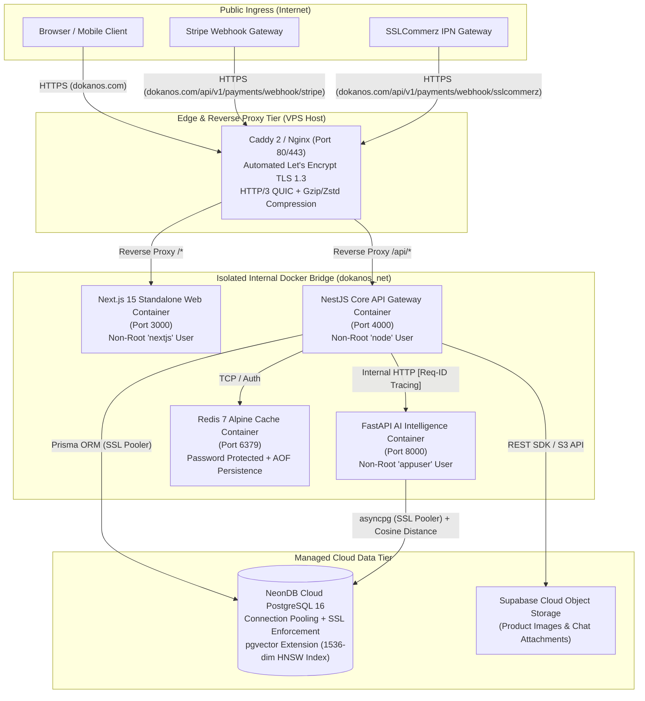

# DokanOS Production Deployment & Architecture Guide

> **Status:** Production Reference Specification  
> **Version:** 1.0.0  
> **Audience:** DevOps Engineers, Backend Architects, Site Reliability Engineers (SRE), AI Engineers

---

## 1. Production Architecture Overview

DokanOS employs a **Polyglot Containerized Micro-Service Architecture** designed for high throughput, robust resilience, and secure separation of concerns:



### Architectural Principles:

1. **Network Isolation:** Only the reverse proxy (`Caddy` / `Nginx`) exposes ports `80` and `443` to the host and public internet.
2. **Private AI Microservice:** The `ai-service` container is **never exposed** to the public internet. It only communicates over the private Docker bridge network (`dokanos_net`) with `api`, verified by `AI_INTERNAL_KEY`.
3. **Stateless App Containers:** Both `web` and `api` containers are completely stateless, allowing horizontal scaling and seamless rolling updates.
4. **Single Source of Truth for Relational & Vector Data:** All relational data and high-dimensional embeddings reside inside **NeonDB PostgreSQL with `pgvector`**, eliminating dual-write sync lags.

---

## 2. Containerization (Docker)

All three applications feature production-hardened, multi-stage Dockerfiles utilizing minimal Alpine / Slim base images and non-root system users:

| Container        | Base Image         | Build Strategy                                           | Exposed Port | Non-Root User    | Healthcheck                                   |
| :--------------- | :----------------- | :------------------------------------------------------- | :----------- | :--------------- | :-------------------------------------------- |
| **`web`**        | `node:22-alpine`   | Multi-stage, Next.js Standalone (`output: 'standalone'`) | 3000         | `nextjs` (1001)  | `curl -f http://localhost:3000/api/health`    |
| **`api`**        | `node:22-alpine`   | Multi-stage, pruned production pnpm dependencies         | 4000         | `node` (1000)    | `curl -f http://localhost:4000/api/v1/health` |
| **`ai-service`** | `python:3.12-slim` | Multi-stage, pip wheel caching, 2 Uvicorn workers        | 8000         | `appuser` (1000) | `curl -f http://localhost:8000/health`        |

### Docker Commands

- **Build production containers locally:**
  ```bash
  docker compose -f docker-compose.prod.yml build
  ```
- **Start the production stack:**
  ```bash
  docker compose -f docker-compose.prod.yml up -d
  ```
- **Inspect running containers and health status:**
  ```bash
  docker compose -f docker-compose.prod.yml ps
  ```

---

## 3. Deployment Architecture & Hosting Matrix

DokanOS supports both fully managed cloud primitives and self-hosted container orchestration:

| Component             | Recommended Production Option                      | Alternative Tier                 | Architectural Rationale                                                                                                                                                                                                 |
| :-------------------- | :------------------------------------------------- | :------------------------------- | :---------------------------------------------------------------------------------------------------------------------------------------------------------------------------------------------------------------------- |
| **Frontend (`web`)**  | **Vercel** / Standalone Docker on VPS              | Cloudflare Pages / AWS ECS       | Vercel provides native Next.js edge caching and asset optimization. Alternatively, `apps/web/Dockerfile` compiles a self-contained standalone server (`output: 'standalone'`) for zero-dependency container deployment. |
| **Backend (`api`)**   | **Ubuntu VPS with Caddy** (Hetzner / DigitalOcean) | AWS ECS Fargate / Render         | Low latency, full control over WebSocket connections (`Socket.IO` Redis adapter), HTTP/3 termination, and zero per-request pricing fees.                                                                                |
| **Database**          | **NeonDB PostgreSQL 16 (Serverless)**              | Supabase / AWS RDS PostgreSQL 16 | Native `pgvector` extension for 1536-dimension embeddings, pgbouncer connection pooling (`sslmode=require`), zero-downtime branching for testing migrations.                                                            |
| **AI Microservice**   | **Private Docker Container** (`dokanos_net`)       | GCP Cloud Run / Modal            | Keeps AI processing private, zero egress costs between NestJS API and FastAPI, authenticated via shared secret `AI_INTERNAL_KEY`.                                                                                       |
| **Object Storage**    | **Cloudflare R2** / Supabase Storage               | AWS S3 + CloudFront CDN          | S3-compatible API for product media and seller uploads with **zero egress bandwidth fees**, signed upload URLs, and global CDN caching.                                                                                 |
| **Distributed Cache** | **Redis 7 Alpine** (Containerized or Upstash)      | AWS ElastiCache                  | Sub-millisecond rate-limiting, session caching, and WebSocket pub/sub fan-out across multiple API replicas.                                                                                                             |

---

## 4. CI/CD Pipeline (GitHub Actions)

Continuous Integration and Continuous Deployment are automated across two workflows located in `.github/workflows/`:

### 1. `ci.yml` (Triggered on Pull Request & Push to `main`/`develop`)

- **`test-and-build-typescript`:**
  - Installs dependencies using `pnpm install --frozen-lockfile`.
  - Generates Prisma client.
  - Builds NestJS API (`pnpm --filter api build`).
  - Builds Next.js Web (`pnpm --filter web build`).
- **`test-ai-service`:**
  - Lints Python code with `flake8`.
  - Verifies package imports and Pydantic schemas.
- **`validate-docker-builds`:**
  - Builds Docker container images with GitHub Actions layer caching to prevent broken image pushes.

### 2. `deploy.yml` (Automated Production VPS Deployment)

- Authenticates with **GitHub Container Registry** (`ghcr.io`).
- Builds and publishes multi-architecture images tagged with commit SHA and `:latest`.
- Connects to VPS via secure SSH key:
  1. Pulls new images from `ghcr.io`.
  2. Runs safe database migrations:
     ```bash
     docker run --rm --env-file /opt/dokanos/apps/api/.env \
       ghcr.io/shahariarshawon/dokanos-api:latest \
       npx prisma migrate deploy
     ```
  3. Executes rolling container restart:
     ```bash
     docker compose -f docker-compose.prod.yml up -d --remove-orphans
     ```
  4. Runs post-deployment health check against `/api/v1/health`.

---

## 5. Production VPS Deployment Guide

### Provisioning Ubuntu VPS (Hetzner / DigitalOcean / AWS EC2)

1. **Clone repository onto VPS:**
   ```bash
   git clone https://github.com/shahariarshawon/DokanOS.git /opt/dokanos
   cd /opt/dokanos
   ```
2. **Run the automated provisioning script:**

   ```bash
   chmod +x scripts/setup-vps.sh
   ./scripts/setup-vps.sh
   ```

   _This automatically enables UFW firewall (allowing only ports 22, 80, 443), configures Fail2ban, installs Docker Engine & Docker Compose plugin, and sets up Docker daemon log rotation._

3. **Configure Production Environment Files:**
   - Copy `.env.production.example` to `apps/api/.env` and `apps/ai-service/.env`.
   - Populate live keys (NeonDB, Stripe, SSLCommerz, Gemini, Supabase).
4. **Deploy Stack:**
   ```bash
   chmod +x scripts/deploy.sh
   ./scripts/deploy.sh
   ```

---

## 6. Database Migration Management

### Migration Safety Rules in Production

1. **Never run `prisma migrate dev` in production.** Always use:
   ```bash
   npx prisma migrate deploy
   ```
2. **Backward-Compatible Schema Changes:**
   - When renaming columns, add the new column first, deploy code writing to both, backfill existing records, and drop the old column in a subsequent release.
   - Avoid destructive raw `ALTER TABLE DROP COLUMN` without a deprecation window.
3. **Migration Verification:**
   - Check pending migrations before deployment:
     ```bash
     ./scripts/migrate.sh
     ```

---

## 7. Monitoring, Health Checks & Observability

### 1. Multi-Tier Health Check Endpoints

| Service             | Endpoint                   | Probe Type          | Verification Payload                                                                              |
| :------------------ | :------------------------- | :------------------ | :------------------------------------------------------------------------------------------------ |
| **API Gateway**     | `GET /api/v1/health`       | **Liveness Probe**  | Process uptime, heap memory usage, service version.                                               |
| **API Gateway**     | `GET /api/v1/health/ready` | **Readiness Probe** | Live PostgreSQL query (`SELECT 1`), Redis ping latency, AI service connectivity probe.            |
| **Web Storefront**  | `GET /api/health`          | **Liveness Probe**  | Next.js server uptime, memory usage, node version.                                                |
| **AI Microservice** | `GET /health`              | **Full Probe**      | Vector dimensions (1536), embedding/recommendation/LLM cache metrics, database connection status. |

### 2. Request Correlation Tracing (`X-Request-Id`)

Every incoming HTTP request through `LoggingMiddleware` receives or propagates an `X-Request-Id` UUID across the network boundary:

```text
Client -> Caddy -> NestJS [X-Request-Id: 4d34b588-...] -> FastAPI [X-Request-Id: 4d34b588-...]
```

If an unhandled exception or upstream timeout occurs, the correlation ID is included in the unified JSON error envelope:

```json
{
  "success": false,
  "statusCode": 500,
  "error": {
    "code": "INTERNAL_SERVER_ERROR",
    "message": "Gateway timeout"
  },
  "correlationId": "4d34b588-3a56-493e-a253-9dbe4ba0880c",
  "timestamp": "2026-09-24T23:20:00.000Z",
  "path": "/api/v1/orders"
}
```

### 3. Error Tracking (Sentry Integration)

DokanOS supports drop-in Sentry error tracking for both NestJS and Next.js by setting `SENTRY_DSN` in environment configurations. Exceptions captured by `HttpExceptionFilter` and Next.js error boundaries automatically attach the `X-Request-Id` and user context (with PII redacted).

### 4. Docker Log Rotation

All production containers are configured with `json-file` log drivers to prevent disk exhaustion:

```yaml
logging:
  driver: 'json-file'
  options:
    max-size: '20m'
    max-file: '5'
```

---

## 8. Production Security Checklist

- [x] **Zero Trust on Frontend Payments:** Payment confirmation occurs exclusively via cryptographically signed webhooks (`Stripe-Signature` and SSLCommerz IPN).
- [x] **Least Privilege Container Users:** All containers execute under unprivileged users (`node`, `nextjs`, `appuser`), preventing container breakout vulnerabilities.
- [x] **Strict Ingress Control:** Private microservices (`ai-service`, `redis`) have no host port bindings and communicate solely over internal bridge networks.
- [x] **Secure Reverse Proxy & TLS:** Caddy/Nginx enforces modern TLS 1.3, HSTS (`Strict-Transport-Security`), `X-Frame-Options: DENY`, `X-Content-Type-Options: nosniff`, and `Referrer-Policy`.
- [x] **Database SSL Enforcement:** NeonDB connections strictly enforce `sslmode=require` with certificate validation.
- [x] **Input Validation & Sanitization:** Global `ValidationPipe` with `whitelist: true` and `forbidNonWhitelisted: true` strips all untyped payload parameters.
- [x] **Graceful Process Lifecycle:** `enableShutdownHooks()` handles SIGTERM/SIGINT signals to allow active database transactions to drain cleanly.
